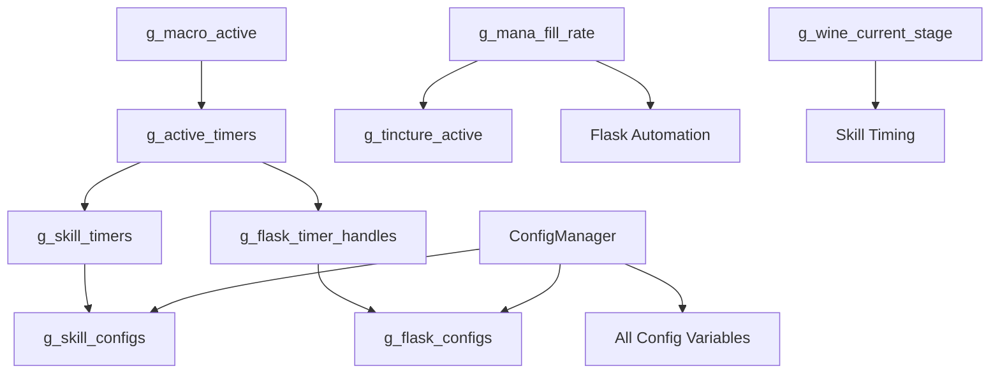

# データ構造とグローバル変数仕様書

## 概要

Path of Exileマクロシステムで使用される全グローバル変数とデータ構造の詳細仕様。各変数の型、初期値、用途、更新タイミング、および関連する関数を包括的に文書化。

## 目次

1. [コア制御変数](#コア制御変数)
2. [タイマー管理システム](#タイマー管理システム)
3. [スキル自動化システム](#スキル自動化システム)
4. [フラスコ管理システム](#フラスコ管理システム)
5. [ティンクチャー管理システム](#ティンクチャー管理システム)
6. [マナ監視システム](#マナ監視システム)
7. [設定管理変数](#設定管理変数)
8. [ログとデバッグ](#ログとデバッグ)
9. [データ構造の関係性](#データ構造の関係性)

---

## コア制御変数

### Main.ahk

| 変数名 | 型 | 初期値 | 用途 | 更新関数 |
|--------|----|---------|----|----------|
| `g_auto_start_enabled` | Boolean | `false` | 自動開始機能の有効/無効 | `EnableAutoStart()`, `DisableAutoStart()` |
| `g_auto_start_timer` | String | `""` | 自動開始タイマーの参照 | `StartAutoStartSequence()` |
| `g_auto_start_attempts` | Integer | `0` | 自動開始試行回数 | `CheckAutoStart()` |
| `g_auto_start_max_attempts` | Integer | `30` | 最大自動開始試行回数 | 設定値（固定） |
| `g_initialization_complete` | Boolean | `false` | 初期化完了フラグ | `CompleteInitialization()` |

### Config.ahk

| 変数名 | 型 | 初期値 | 用途 | 更新関数 |
|--------|----|---------|----|----------|
| `g_macro_active` | Boolean | `false` | **マクロメイン状態** | `StartMacro()`, `StopMacro()` |
| `g_macro_start_time` | Integer | `0` | マクロ開始時刻 | `StartMacro()` |
| `g_debug_mode` | Boolean | `false` | デバッグモード | `ConfigManager.Get()` |
| `g_log_enabled` | Boolean | `true` | ログ記録有効 | `ConfigManager.Get()` |

**重要**: `g_macro_active`は全システムの主制御変数。この値により全タイマーとオートメーションが制御される。

---

## タイマー管理システム

### Core/TimerManager.ahk

#### 主要Map構造

| 変数名 | 型 | 初期値 | キー型 | 値型 | 用途 |
|--------|----|---------|----|-----|-----|
| `g_active_timers` | Map | `Map()` | String | Object | **アクティブタイマー登録** |
| `g_timer_execution_count` | Map | `Map()` | String | Integer | タイマー実行回数統計 |
| `g_timer_errors` | Map | `Map()` | String | Integer | タイマー別エラー回数 |
| `g_timer_executing` | Map | `Map()` | String | Boolean | タイマー実行中フラグ |
| `g_timer_priorities` | Map | `Map()` | String | String | タイマー優先度レベル |
| `g_timer_performance` | Map | `Map()` | String | Object | パフォーマンス統計 |

#### g_active_timersの構造詳細

```autohotkey
g_active_timers[timer_name] := {
    callback: "FunctionName",
    interval: 1000,
    priority: "Normal",
    created_time: A_TickCount,
    last_execution: 0
}
```

#### 制御変数

| 変数名 | 型 | 初期値 | 用途 | 更新関数 |
|--------|----|---------|----|----------|
| `g_flask_timer_active` | Boolean | `false` | フラスコタイマー状態 | `CreateFlaskTimer()`, `StopFlaskTimer()` |
| `g_status_update_needed` | Boolean | `false` | UI更新要求フラグ | `RequestStatusUpdate()` |

**更新タイミング**:
- `RegisterTimer()`: タイマー登録時
- `UnregisterTimer()`: タイマー削除時
- `ExecuteTimer()`: 実行時統計更新
- `ShutdownTimers()`: 全タイマー停止時

---

## スキル自動化システム

### Features/Skills/SkillController.ahk

| 変数名 | 型 | 初期値 | キー型 | 値型 | 用途 |
|--------|----|---------|----|-----|-----|
| `g_skill_timers` | Map | `Map()` | String | String | **スキル→タイマー名マッピング** |
| `g_skill_last_use` | Map | `Map()` | String | Integer | スキル最終使用時刻 |
| `g_skill_enabled` | Map | `Map()` | String | Boolean | スキル有効/無効状態 |

#### g_skill_timersの構造

```autohotkey
g_skill_timers["SkillE"] := "SkillE_Timer"
g_skill_timers["SkillR"] := "SkillR_Timer"
g_skill_timers["SkillT"] := "SkillT_Timer"
// 最大10スキル対応
```

### Features/Skills/SkillConfigurator.ahk

| 変数名 | 型 | 初期値 | キー型 | 値型 | 用途 |
|--------|----|---------|----|-----|-----|
| `g_skill_configs` | Map | `Map()` | String | Object | **スキル設定オブジェクト** |

#### g_skill_configsの詳細構造

```autohotkey
g_skill_configs["SkillE"] := {
    name: "スキルE",
    key: "E",
    enabled: true,
    min_interval: 1000,
    max_interval: 1100,
    priority: 3,
    group: 1,
    last_use: 0,
    success_count: 0,
    error_count: 0
}
```

### Features/Skills/SkillStatistics.ahk

| 変数名 | 型 | 初期値 | キー型 | 値型 | 用途 |
|--------|----|---------|----|-----|-----|
| `g_skill_stats` | Map | `Map()` | String | Object | スキル使用統計 |

### Features/Skills/WineManager.ahk

| 変数名 | 型 | 初期値 | 用途 | 更新関数 |
|--------|----|---------|----|----------|
| `g_wine_stage_start_time` | Integer | `0` | Wine of Prophetステージ開始時刻 | `StartWineStage()` |
| `g_wine_current_stage` | Integer | `0` | 現在のWineステージ（0-4） | `UpdateWineStage()` |

**更新タイミング**:
- `InitializeSkillSystem()`: システム初期化時
- `LoadSkillConfiguration()`: 設定読み込み時
- `UseSkill()`: スキル使用時
- `UpdateSkillStats()`: 統計更新時

---

## フラスコ管理システム

### Features/Flask/FlaskController.ahk

| 変数名 | 型 | 初期値 | キー型 | 値型 | 用途 |
|--------|----|---------|----|-----|-----|
| `g_flask_timer_handles` | Map | `Map()` | String | String | フラスコタイマー参照 |
| `g_flask_automation_paused` | Boolean | `false` | フラスコ自動化一時停止 | `PauseFlaskAutomation()` |
| `g_flask_active_flasks` | Map | `Map()` | String | Boolean | アクティブフラスコ追跡 |

### Features/Flask/FlaskConfiguration.ahk

| 変数名 | 型 | 初期値 | キー型 | 値型 | 用途 |
|--------|----|---------|----|-----|-----|
| `g_flask_configs` | Map | `Map()` | String | Object | **フラスコ設定オブジェクト** |

#### g_flask_configsの詳細構造

```autohotkey
g_flask_configs["Flask1"] := {
    name: "ライフフラスコ",
    key: "1",
    enabled: true,
    type: "Life",
    min_interval: 4500,
    max_interval: 4800,
    priority: "High",
    auto_use: true,
    charges: 0,
    max_charges: 5
}
```

### Features/Flask/FlaskChargeManager.ahk

| 変数名 | 型 | 初期値 | キー型 | 値型 | 用途 |
|--------|----|---------|----|-----|-----|
| `g_flask_charge_tracker` | Map | `Map()` | String | Integer | フラスコチャージ状態追跡 |

### Features/Flask/FlaskStatistics.ahk

| 変数名 | 型 | 初期値 | キー型 | 値型 | 用途 |
|--------|----|---------|----|-----|-----|
| `g_flask_use_count` | Map | `Map()` | String | Integer | フラスコ使用回数 |
| `g_flask_last_use_time` | Map | `Map()` | String | Integer | 最終使用時刻 |
| `g_flask_usage_history` | Array | `[]` | Integer | Object | 使用履歴配列 |

#### グローバル統計オブジェクト

```autohotkey
g_flask_stats := {
    total_uses: 0,
    successful_uses: 0,
    failed_uses: 0,
    average_interval: 0,
    session_start: A_TickCount,
    last_reset: A_TickCount
}
```

| 変数名 | 型 | 初期値 | 用途 |
|--------|----|---------|----|
| `g_max_history_entries` | Integer | `100` | 履歴保存最大数 |

**更新タイミング**:
- `InitializeFlasks()`: システム初期化時
- `UseFlask()`: フラスコ使用時
- `UpdateFlaskCharges()`: チャージ更新時
- `ResetFlaskStats()`: 統計リセット時

---

## ティンクチャー管理システム

### Features/TinctureManager.ahk

#### 主要制御変数

| 変数名 | 型 | 初期値 | 用途 | 更新関数 |
|--------|----|---------|----|----------|
| `g_tincture_active` | Boolean | `false` | **ティンクチャー有効状態** | `UseTincture()`, `DeactivateTincture()` |
| `g_tincture_cooldown_end` | Integer | `0` | クールダウン終了時刻 | `SetTinctureCooldown()` |
| `g_tincture_retry_count` | Integer | `0` | リトライ回数カウンター | `RetryTincture()` |
| `g_tincture_retry_max` | Integer | `5` | 最大リトライ回数 | 設定値 |
| `g_tincture_verification_pending` | Boolean | `false` | 検証待機状態 | `StartTinctureVerification()` |
| `g_tincture_last_use_time` | Integer | `0` | 最終使用時刻 | `UseTincture()` |
| `g_tincture_retry_timer_active` | Boolean | `false` | リトライタイマー状態 | `StartRetryTimer()` |

#### 統計とログ変数

| 変数名 | 型 | 初期値 | 用途 | 更新関数 |
|--------|----|---------|----|----------|
| `g_tincture_history` | Array | `[]` | 使用履歴配列 | `RecordTinctureUse()` |
| `g_tincture_success_count` | Integer | `0` | 成功回数 | `RecordTinctureSuccess()` |
| `g_tincture_failure_count` | Integer | `0` | 失敗回数 | `RecordTinctureFailure()` |
| `g_tincture_total_attempts` | Integer | `0` | 総試行回数 | `AttemptTincture()` |
| `g_tincture_verification_method` | String | `"mana"` | 検証方法 | 設定値 |

#### 履歴オブジェクト構造

```autohotkey
tincture_history_entry := {
    timestamp: A_TickCount,
    action: "use|retry|success|failure",
    retry_count: g_tincture_retry_count,
    verification_result: true/false,
    mana_state: "depleted|available"
}
```

**更新タイミング**:
- `UseTincture()`: ティンクチャー使用時
- `VerifyTinctureEffect()`: 効果検証時
- `RetryTincture()`: リトライ時
- `ResetTinctureStats()`: 統計リセット時

---

## マナ監視システム

### Features/ManaMonitor.ahk

#### 座標とジオメトリ変数

| 変数名 | 型 | 初期値 | 用途 | 更新関数 |
|--------|----|---------|----|----------|
| `g_mana_center_x` | Integer | `3294` | マナオーブ中心X座標 | `ConfigManager.Get()` |
| `g_mana_center_y` | Integer | `1300` | マナオーブ中心Y座標 | `ConfigManager.Get()` |
| `g_mana_radius` | Integer | `139` | マナオーブ半径 | `ConfigManager.Get()` |

#### 状態制御変数

| 変数名 | 型 | 初期値 | 用途 | 更新関数 |
|--------|----|---------|----|----------|
| `g_mana_monitoring_enabled` | Boolean | `true` | マナ監視有効フラグ | `EnableManaMonitoring()` |
| `g_mana_fill_rate` | Integer | `100` | **現在マナ充填率（%）** | `CheckManaLevel()` |
| `g_last_mana_state` | Boolean | `true` | 前回マナ状態 | `CheckManaLevel()` |
| `g_mana_depleted` | Boolean | `false` | **マナ枯渇フラグ** | `UpdateManaState()` |
| `g_mana_flask_key` | String | `"2"` | マナフラスコキー | 設定値 |

#### 最適化とパフォーマンス変数

| 変数名 | 型 | 初期値 | 用途 | 更新関数 |
|--------|----|---------|----|----------|
| `g_mana_optimized` | Boolean | `true` | 最適化モード | `ConfigManager.Get()` |
| `g_mana_check_count` | Integer | `0` | チェック回数カウンター | `CheckManaLevel()` |
| `g_mana_check_errors` | Integer | `0` | エラー回数カウンター | `HandleManaCheckError()` |
| `g_last_full_check_time` | Integer | `0` | 最終フルチェック時刻 | `PerformFullManaCheck()` |
| `g_mana_state_stable_count` | Integer | `0` | 状態安定カウンター | `CheckManaLevel()` |
| `g_performance_mode` | Boolean | `true` | パフォーマンスモード | 設定値 |

**更新タイミング**:
- `MonitorMana()`: 100ms間隔でマナレベルチェック
- `HandleManaDepletion()`: マナ枯渇検出時
- `OptimizeManaChecking()`: 最適化実行時

---

## 設定管理変数

### キー設定定数

| 変数名 | 型 | 初期値 | 用途 |
|--------|----|---------|----|
| `KEY_TINCTURE` | String | `"3"` | ティンクチャーキー |
| `KEY_MANA_FLASK` | String | `"2"` | マナフラスコキー |
| `KEY_SKILL_E` | String | `"E"` | Eスキルキー |
| `KEY_SKILL_R` | String | `"R"` | Rスキルキー |
| `KEY_SKILL_T` | String | `"T"` | Tスキルキー |
| `KEY_WINE_PROPHET` | String | `"4"` | Wine of Prophetキー |

### タイミング設定オブジェクト

```autohotkey
TIMING_SKILL_ER := {
    min: 1000,
    max: 1100
}

TIMING_SKILL_T := {
    min: 4100,
    max: 4200
}

TIMING_FLASK := {
    min: 4500,
    max: 4800
}
```

| 変数名 | 型 | 初期値 | 用途 |
|--------|----|---------|----|
| `TIMING_MANA_DEPLETED_CD` | Integer | `5410` | マナ枯渇クールダウン（ms） |

### 画面状態検出変数

| 変数名 | 型 | 初期値 | 用途 | 更新関数 |
|--------|----|---------|----|----------|
| `g_loading_screen_active` | Boolean | `false` | ローディング画面状態 | `CheckLoadingScreen()` |
| `g_was_macro_active_before_loading` | Boolean | `false` | ローディング前マクロ状態保存 | `OnLoadingStart()` |
| `g_loading_check_enabled` | Boolean | `true` | ローディング検出有効 | 設定値 |
| `g_waiting_for_user_input` | Boolean | `false` | ユーザー入力待機 | `WaitForUserInput()` |

### UI参照変数

| 変数名 | 型 | 初期値 | 用途 | 更新関数 |
|--------|----|---------|----|----------|
| `overlayGui` | Object | `""` | オーバーレイGUI参照 | `CreateOverlay()` |
| `statusGui` | Object | `""` | ステータスGUI参照 | `CreateStatusDisplay()` |
| `debugGuis` | Array | `[]` | デバッグGUI配列 | `CreateDebugDisplay()` |

---

## ログとデバッグ

### Utils/Logger.ahk

#### ログレベル定義オブジェクト

```autohotkey
LOG_LEVEL := {
    DEBUG: 1,
    INFO: 2,
    WARN: 3,
    ERROR: 4,
    CRITICAL: 5
}
```

#### ログ管理変数

| 変数名 | 型 | 初期値 | 用途 | 更新関数 |
|--------|----|---------|----|----------|
| `g_current_log_level` | Integer | `LOG_LEVEL.INFO` | 現在ログレベル | `SetLogLevel()` |
| `g_log_file` | String | `""` | ログファイルパス | `InitializeLogger()` |
| `g_log_dir` | String | `A_ScriptDir . "\logs"` | ログディレクトリ | 固定値 |
| `g_log_buffer` | Array | `[]` | ログエントリバッファ | `WriteLog()` |
| `g_log_buffer_size` | Integer | `50` | バッファサイズ制限 | 設定値 |
| `g_log_file_handle` | Object | `""` | ファイルハンドル参照 | `OpenLogFile()` |
| `g_log_write_count` | Integer | `0` | 書き込み操作カウンター | `WriteLog()` |
| `g_log_rotation_in_progress` | Boolean | `false` | ローテーション進行中 | `RotateLog()` |

#### ログ統計オブジェクト

```autohotkey
g_log_stats := {
    debug_count: 0,
    info_count: 0,
    warn_count: 0,
    error_count: 0,
    critical_count: 0,
    total_writes: 0,
    buffer_flushes: 0,
    rotation_count: 0,
    session_start: A_TickCount
}
```

#### パフォーマンス測定

| 変数名 | 型 | 初期値 | キー型 | 値型 | 用途 |
|--------|----|---------|----|-----|-----|
| `g_performance_timers` | Map | `Map()` | String | Object | パフォーマンスタイマー追跡 |

### Utils/ColorDetection.ahk

| 変数名 | 型 | 初期値 | 用途 | 更新関数 |
|--------|----|---------|----|----------|
| `g_pixel_cache` | Map | `Map()` | ピクセル色キャッシュ | `GetPixelColor()` |
| `g_cache_hit_count` | Integer | `0` | キャッシュヒット回数 | `GetPixelColor()` |
| `g_cache_miss_count` | Integer | `0` | キャッシュミス回数 | `GetPixelColor()` |
| `g_slow_detection_count` | Integer | `0` | 低速検出回数 | `DetectColorSlow()` |

---

## データ構造の関係性

### 主要な依存関係



### データフロー概要

1. **初期化フロー**:
   - `ConfigManager` → 各種設定Map → タイマー登録 → システム開始

2. **実行時フロー**:
   - `g_macro_active` → タイマー実行 → 各機能モジュール → 統計更新

3. **状態管理フロー**:
   - マナ監視 → ティンクチャー制御 → スキル/フラスコ調整

### 重要な制約

1. **タイマー競合防止**: `g_timer_executing`で同時実行を防止
2. **状態整合性**: マナ状態とティンクチャー状態の同期
3. **パフォーマンス**: Map操作の最適化とキャッシュ活用
4. **エラー処理**: 各Mapでエラーカウンターを維持

### メモリ管理考慮事項

- **履歴配列**: 最大エントリ数制限でメモリリーク防止
- **キャッシュ**: 定期的なクリアで新鮮性維持
- **統計データ**: セッション単位でリセット機能提供

---

## 補足事項

- **型注釈**: AutoHotkey v2の動的型システムを活用
- **命名規則**: グローバル変数は`g_`プレフィックス、Map/配列は複数形
- **初期化順序**: 依存関係に基づく適切な初期化シーケンス必須
- **デバッグ支援**: 全主要データ構造にデバッグ出力機能内蔵