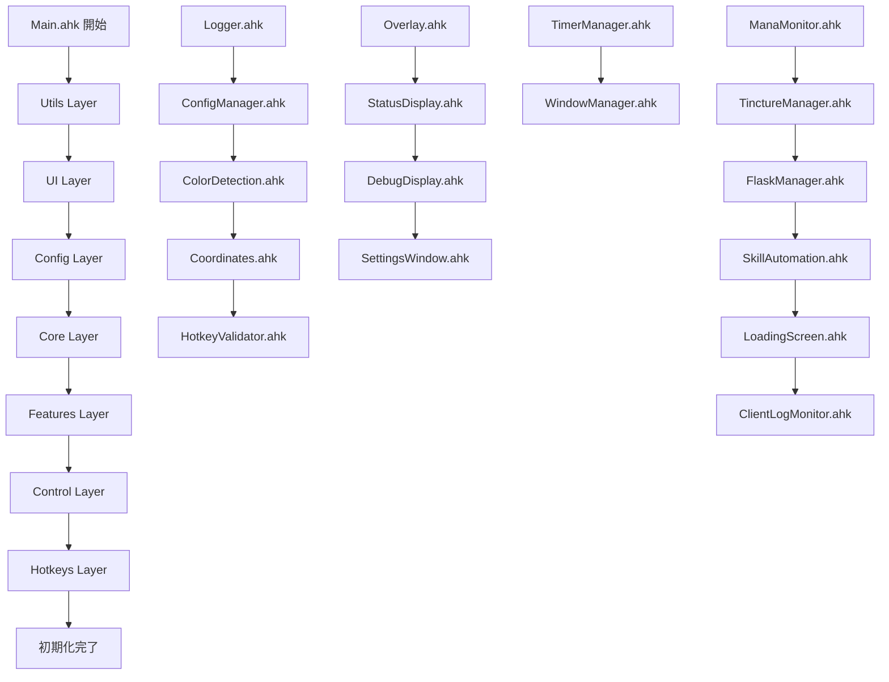
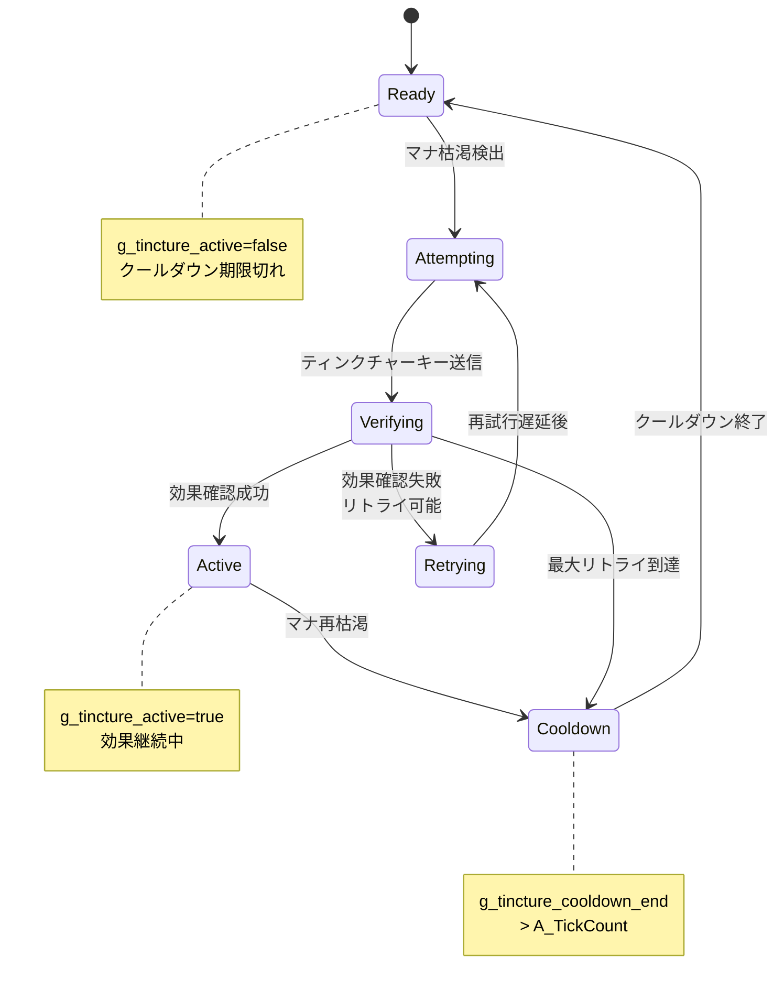
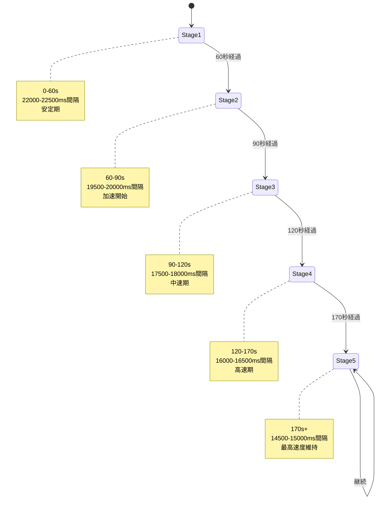
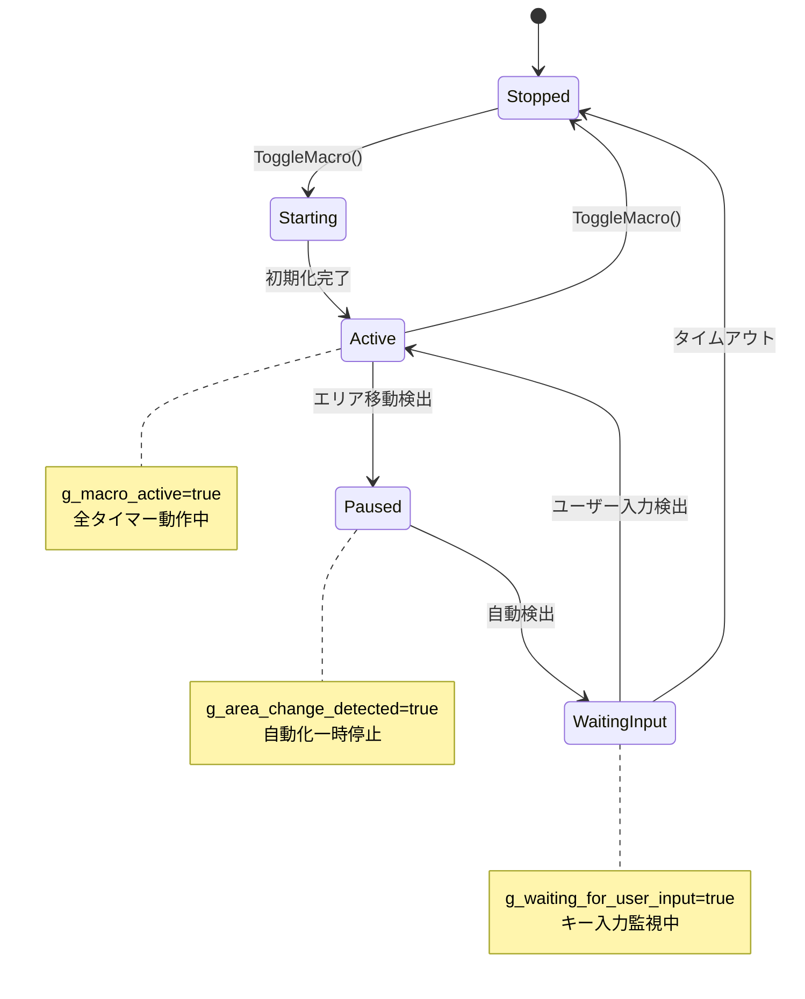
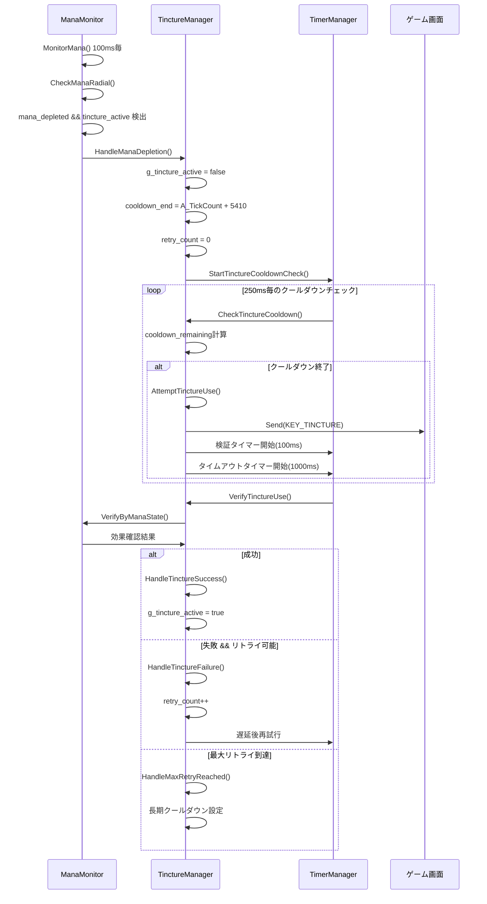
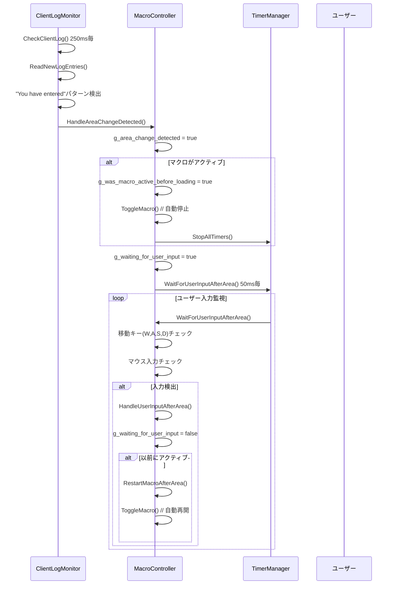
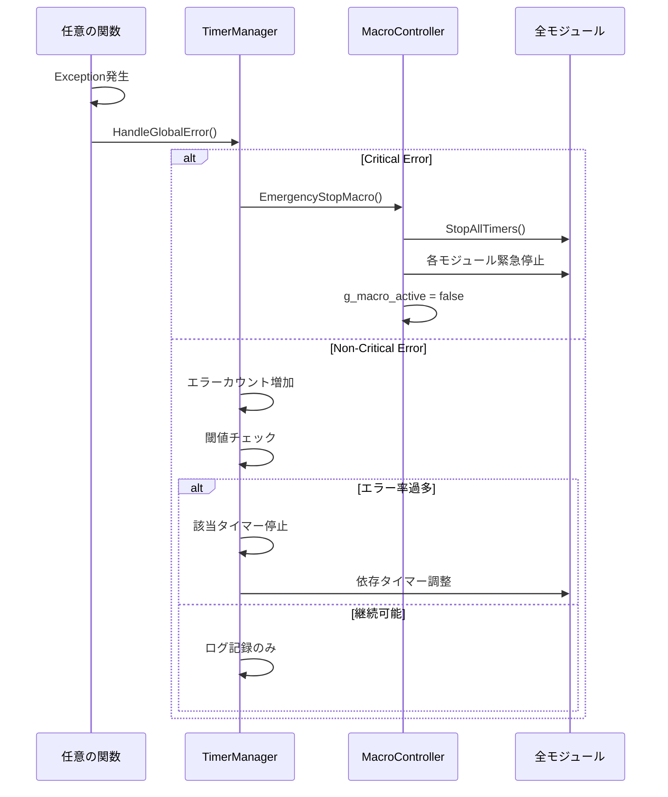
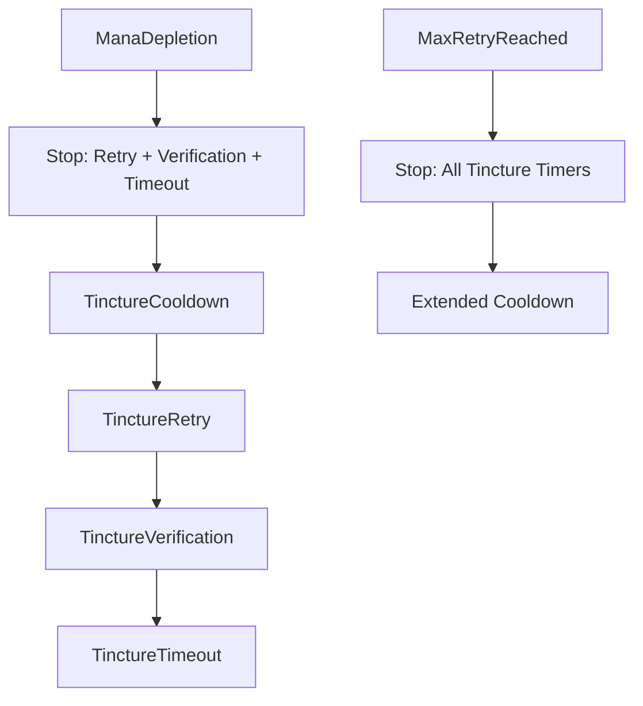

# イベントフローと状態遷移仕様書

## 概要

Path of Exileマクロシステムの動作フロー、状態遷移、タイマー相互作用を詳細に文書化。設計意図と技術的な実装理由を含む包括的な分析。

## 目次

1. [起動シーケンス](#起動シーケンス)
2. [主要な状態遷移](#主要な状態遷移)
3. [重要なイベントチェーン](#重要なイベントチェーン)
4. [タイマー間の相互作用](#タイマー間の相互作用)
5. [設計意図と技術的判断](#設計意図と技術的判断)

---

## 起動シーケンス

### モジュール初期化順序

Path of Exileマクロは厳密な依存関係階層に基づいて初期化される：



#### 依存関係の技術的理由

**Utils → UI → Config → Core → Features** の順序は以下の理由による：

1. **Utils Layer**: 基盤サービス（ログ、設定、色検出）は他の全モジュールで使用
2. **UI Layer**: エラー表示やオーバーレイは初期化エラー時に必要
3. **Config Layer**: グローバル変数と設定値は Core と Features で参照
4. **Core Layer**: タイマー管理と画面管理は Features の動作基盤
5. **Features Layer**: 実際の自動化機能、Core への依存あり

### AutoStart実装詳細

```autohotkey
// Main.ahk:126-187
EnableAutoStart() {
    global g_auto_start_enabled, g_auto_start_timer
    
    // 段階的なチェック戦略
    delay := ConfigManager.Get("General", "AutoStartDelay", 2000)
    g_auto_start_enabled := true
    
    // 遅延後に開始 - システム安定化待ち
    g_auto_start_timer := SetTimer(TryAutoStart, delay)
}

TryAutoStart() {
    global g_auto_start_attempts, g_auto_start_max_attempts
    
    if (g_auto_start_attempts >= g_auto_start_max_attempts) {
        // 30秒タイムアウト - 長すぎる待機防止
        DisableAutoStart()
        return
    }
    
    g_auto_start_attempts++
    
    if (IsTargetWindowActive()) {
        // ゲーム画面検出時に自動開始
        DisableAutoStart()
        ToggleMacro() // マクロ自動起動
        return
    }
    
    // 1秒間隔での再チェック
    g_auto_start_timer := SetTimer(TryAutoStart, 1000)
}
```

**設計意図**:
- **遅延開始**: システム起動直後の不安定性回避
- **ポーリング方式**: イベント駆動より単純で確実
- **タイムアウト**: 無限待機によるリソースリーク防止

### 初期化時エラーハンドリング

```autohotkey
// Main.ahk:56-125
OnError(HandleGlobalError, 1)

HandleGlobalError(exception, mode) {
    critical_errors := ["Critical", "Access", "Memory"]
    
    if (HasVal(critical_errors, exception.what)) {
        // クリティカルエラー - 即座停止
        if (g_initialization_complete) {
            EmergencyStopMacro()
        }
        ShowOverlay("Critical Error: " . exception.message, 5000)
        return 0 // エラー処理完了
    }
    
    // 非クリティカル - 継続実行
    LogError("Global", "Non-critical error: " . exception.message)
    return -1 // デフォルトエラー処理続行
}
```

**エラー分類の根拠**:
- **Critical/Access/Memory**: システムレベルエラー、回復不可能
- **その他**: 機能レベルエラー、部分的な動作継続可能

---

## 主要な状態遷移

### ティンクチャー状態機械



#### 状態変数とトリガー

| 状態 | 主要変数 | トリガー条件 | 遷移先 |
|------|----------|--------------|--------|
| **Ready** | `g_tincture_active=false`<br/>`g_tincture_cooldown_end < A_TickCount` | マナ枯渇検出 | Attempting |
| **Attempting** | `g_tincture_retry_count++` | キー送信成功 | Verifying |
| **Verifying** | `g_tincture_verification_pending=true` | 100ms後自動 | Active/Retrying |
| **Active** | `g_tincture_active=true` | マナ再枯渇 | Cooldown |
| **Retrying** | `g_tincture_retry_timer_active=true` | 遅延後 | Attempting |
| **Cooldown** | `g_tincture_cooldown_end=A_TickCount+5410` | 時間経過 | Ready |

**状態遷移の設計根拠**:

1. **Ready→Attempting**: マナ枯渇は即座対応が必要
2. **Attempting→Verifying**: キー送信後の効果確認期間
3. **Verifying→Active/Retrying**: 効果の有無で分岐
4. **Active→Cooldown**: ゲーム内クールダウンの尊重
5. **Retrying**: 一時的な失敗への対応（ネットワーク遅延等）

### Wine of Prophet段階遷移



#### 動的タイミング計算

```autohotkey
// WineManager.ahk:67-113
GetCurrentWineStage(elapsedTime) {
    stages := [
        {duration: 60000, min: 22000, max: 22500, avg: 22250},  // Stage 1
        {duration: 30000, min: 19500, max: 20000, avg: 19750},  // Stage 2
        {duration: 30000, min: 17500, max: 18000, avg: 17750},  // Stage 3
        {duration: 50000, min: 16000, max: 16500, avg: 16250},  // Stage 4
        {duration: 0,     min: 14500, max: 15000, avg: 14750}   // Stage 5+
    ]
    
    currentStage := 1
    accumulatedTime := 0
    
    for (stage in stages) {
        if (stage.duration == 0 || elapsedTime <= accumulatedTime + stage.duration) {
            break
        }
        accumulatedTime += stage.duration
        currentStage++
    }
    
    return {
        stage: currentStage,
        timing: stages[currentStage],
        progress: (elapsedTime - accumulatedTime) / stages[currentStage].duration
    }
}
```

**段階的加速の根拠**:
- **Stage 1-2**: ビルドのバフスタック期間、保守的な間隔
- **Stage 3-4**: バフ安定期、効率重視で加速
- **Stage 5**: 最適化期、最大効率での維持

### マクロ全体状態



---

## 重要なイベントチェーン

### マナ枯渇→ティンクチャー再使用フロー



**フロー設計の技術的判断**:

1. **100ms間隔監視**: マナ枯渇の即座検出（ゲーム応答性）
2. **5410msクールダウン**: ゲーム内クールダウン（5秒）＋安全マージン
3. **100ms検証遅延**: ゲーム内効果反映の待機時間
4. **1000msタイムアウト**: ネットワーク遅延やフレームドロップ対応
5. **指数バックオフ**: 連続失敗時のシステム負荷軽減

### エリア移動検出→自動停止→再開フロー



**エリア移動対応の設計理由**:

1. **250ms監視間隔**: ログファイルI/O負荷との バランス
2. **自動停止**: ローディング中のキー送信は無効＆安全性
3. **状態保存**: ユーザーの使用パターン維持
4. **50ms入力監視**: 入力の即座検出（ユーザー体験）
5. **移動キー特定**: エリア探索開始の確実な指標

### エラー発生時のカスケード処理



**エラーカスケードの防御設計**:

1. **エラー分類**: Critical vs Non-Critical の明確な区分
2. **段階的対応**: 個別停止→部分停止→全停止
3. **依存関係考慮**: 関連タイマーの連鎖停止
4. **状態整合性**: 停止後の変数クリーンアップ

---

## タイマー間の相互作用

### タイマー優先度システム

```autohotkey
// TimerManager.ahk:14-20
class TimerPriority {
    static CRITICAL := 1    // ManaMonitor - 100ms
    static HIGH := 2        // TinctureManager - 250ms  
    static NORMAL := 3      // SkillAutomation - 1000-4000ms
    static LOW := 4         // UI Updates - 1000ms+
}
```

**優先度設計の根拠**:

| 優先度 | モジュール | 間隔 | 理由 |
|--------|------------|------|------|
| **CRITICAL** | ManaMonitor | 100ms | マナ枯渇は即座対応必須 |
| **HIGH** | TinctureManager | 250ms | クールダウン管理は時間に敏感 |
| **NORMAL** | SkillAutomation | 1-4秒 | DPS最適化、遅延許容 |
| **LOW** | UI Updates | 1秒+ | 表示は遅延OK |

### 同時実行制御

```autohotkey
// TimerManager.ahk:87-142
ExecuteTimerCallback(timerName, callback) {
    if (g_timer_executing.Has(timerName) && g_timer_executing[timerName]) {
        LogDebug("TimerManager", "Timer " . timerName . " already executing, skipping")
        return false // 重複実行防止
    }
    
    g_timer_executing[timerName] := true
    
    try {
        %callback%() // コールバック実行
        g_timer_execution_count[timerName]++
    } catch Error as e {
        g_timer_errors[timerName]++
        if (g_timer_errors[timerName] > 10) {
            // エラー過多で自動停止
            StopManagedTimer(timerName)
        }
    } finally {
        g_timer_executing[timerName] := false
    }
}
```

**同時実行制御の理由**:
- **競合状態防止**: グローバル変数の整合性維持
- **リソース保護**: ファイルI/O、色検出の重複防止
- **パフォーマンス**: CPU使用率の制御

### タイマー依存関係と連鎖停止

#### ティンクチャーシステムの依存チェーン



**依存関係の実装**:

```autohotkey
// TinctureManager.ahk:254-276
HandleTinctureSuccess() {
    // 成功時は全関連タイマー停止
    CleanupTinctureTimers()
    g_tincture_active := true
    g_tincture_retry_count := 0
    
    // フラスコタイミングリセット（相互作用）
    ResetFlaskTiming()
}

CleanupTinctureTimers() {
    StopManagedTimer("TinctureRetry")
    StopManagedTimer("TinctureVerification") 
    StopManagedTimer("TinctureTimeout")
    StopManagedTimer("TinctureCooldown")
}
```

#### エリア移動時の全停止カスケード

```autohotkey
// MacroController.ahk:89-134
StopAllTimers() {
    priorities := [4, 3, 2, 1] // LOW → CRITICAL の順
    
    for (priority in priorities) {
        for (timerName, timerInfo in g_active_timers) {
            if (g_timer_priorities[timerName] == priority) {
                StopManagedTimer(timerName)
                // 最大1000ms待機で優雅な停止
                Sleep(50)
            }
        }
    }
}
```

**段階的停止の設計理由**:
1. **依存順序の尊重**: 低優先度から停止で依存関係破綻防止
2. **データ整合性**: 重要な処理（CRITICAL）は最後まで継続
3. **リソース解放**: 段階的停止でメモリリークやハンドル残留防止

### 具体的なタイマー相互作用例

#### 例1: ティンクチャー成功時のフラスコリセット

```autohotkey
// TinctureManager.ahk:HandleTinctureSuccess()
HandleTinctureSuccess() {
    // ティンクチャー効果開始
    g_tincture_active := true
    
    // フラスコタイミングをリセット
    // 理由: ティンクチャー効果による最適化
    ResetFlaskTiming()
}
```

**設計意図**: ティンクチャー効果はマナ消費を変更するため、フラスコの使用パターンも最適化が必要

#### 例2: マナ枯渇時のスキル調整

```autohotkey
// ManaMonitor.ahk:HandleManaDepletion()
HandleManaDepletion() {
    // マナ枯渇状態設定
    g_mana_depleted := true
    
    // 高マナコストスキル（T）の一時停止
    if (g_skill_enabled.Has("SkillT")) {
        ToggleSkill("SkillT", false)
    }
    
    // ティンクチャー再使用処理開始
    HandleTinctureOnManaDepletion()
}
```

**設計意図**: マナ枯渇時は消費を抑制しつつ、回復手段（ティンクチャー）を優先

#### 例3: スキル実行時のフラスコ同期

```autohotkey
// SkillController.ahk:ExecuteSkill()
ExecuteSkill(skill, config) {
    Send(config.key)
    
    // 高優先度スキル実行時はフラスコ使用推奨
    if (config.priority == "High") {
        // フラスコタイマーの前倒し実行
        for (flaskName, flaskConfig in g_flask_configs) {
            if (flaskConfig.priority == "High") {
                UseFlask(flaskName, flaskConfig)
            }
        }
    }
}
```

**設計意図**: 重要スキル実行時は防御的にフラスコを使用

---

## 設計意図と技術的判断

### アーキテクチャ選択の根拠

#### 1. タイマーベースアーキテクチャ vs イベント駆動

**選択**: タイマーベース
**理由**: 
- **ゲーム状態の外部性**: Path of Exileの内部状態に直接アクセス不可
- **ポーリングの必要性**: 色検出、ログ監視は定期実行が必須
- **簡単性**: イベント駆動は複雑なコールバック管理が必要
- **デバッグ性**: タイマー実行は予測可能で追跡しやすい

#### 2. 優先度ベース実行 vs 均等スケジューリング

**選択**: 優先度ベース
**理由**:
- **レスポンス性**: マナ監視は遅延不可
- **リソース制御**: CPU使用率の効率的管理
- **ゲーム特性**: リアルタイム性の要求度に差異

#### 3. 状態機械 vs 手続き型制御

**選択**: 状態機械（ティンクチャー）
**理由**:
- **複雑性管理**: 多段階の処理フローを明確化
- **エラー処理**: 各状態での例外処理を定義可能
- **テスト性**: 状態遷移のユニットテスト実装可能

### パフォーマンス最適化の判断

#### 1. マナ監視間隔: 100ms

**技術的根拠**:
- **ゲーム応答性**: 60fps = 16.7ms、100msは十分高頻度
- **CPU負荷**: 色検出は計算集約的、100msが現実的下限
- **バッテリー効率**: モバイル環境での電力消費考慮

#### 2. エリア検出間隔: 250ms

**技術的根拠**:
- **ファイルI/O負荷**: Client.txtは数MB、頻繁読み込みは負荷大
- **エリア遷移時間**: 通常2-5秒、250msは十分な検出精度
- **ディスク断片化**: 高頻度I/Oはディスク性能に悪影響

#### 3. 色検出キャッシュ: LRU

**技術的根拠**:
- **空間局所性**: マナオーブは狭い範囲に集中
- **時間局所性**: 連続する色検出は類似座標
- **メモリ効率**: 固定サイズキャッシュでメモリリーク防止

### エラー処理戦略の設計判断

#### 1. 段階的エラー分類

```autohotkey
critical_errors := ["Critical", "Access", "Memory"]    // 即座停止
timing_errors := ["Timeout", "Send"]                   // リトライ対象
recoverable_errors := ["Config", "Detection"]          // 継続可能
```

**分類の根拠**:
- **Critical**: システムレベル、ユーザー介入必須
- **Timing**: 一時的、自動回復可能
- **Recoverable**: 部分機能、グレースフル劣化

#### 2. エラー率に基づく自動調整

```autohotkey
if (g_timer_errors[timerName] > 10) {
    StopManagedTimer(timerName)  // 自動停止
}
```

**閾値（10回）の根拠**:
- **短期障害**: 1-3回は一時的障害と判定
- **中期障害**: 4-9回は警告レベル
- **長期障害**: 10回以上は構造的問題、停止必要

### メモリ管理とリソース制御

#### 1. 履歴配列のサイズ制限

```autohotkey
g_flask_usage_history := []
g_max_history_entries := 100

// サイズ制限実装
if (g_flask_usage_history.Length > g_max_history_entries) {
    g_flask_usage_history.RemoveAt(1)  // FIFO
}
```

**サイズ（100エントリ）の根拠**:
- **デバッグ価値**: 過去100回の履歴で十分な分析可能
- **メモリ効率**: エントリ当たり~100bytes、総計10KB程度
- **パフォーマンス**: 配列操作のO(n)コストを実用範囲に制限

#### 2. タイマー実行時間監視

```autohotkey
execution_start := A_TickCount
%callback%()
execution_time := A_TickCount - execution_start

if (execution_time > 100) {
    LogWarn("TimerManager", timerName . " took " . execution_time . "ms")
}
```

**閾値（100ms）の根拠**:
- **応答性維持**: 100ms超過は体感遅延
- **システム負荷**: 長時間実行は他タイマーに影響
- **デバッグ支援**: パフォーマンス問題の早期発見

### 設定値の技術的根拠

| 設定項目 | 値 | 技術的根拠 |
|----------|-----|------------|
| マナ監視間隔 | 100ms | ゲーム応答性とCPU負荷のバランス |
| ティンクチャークールダウン | 5410ms | ゲーム内5秒＋安全マージン410ms |
| AutoStart最大試行 | 30回 | 30秒タイムアウト、起動時間考慮 |
| エラー許容回数 | 10回 | 一時的障害と構造的問題の区分 |
| 履歴最大エントリ | 100個 | デバッグ価値とメモリ効率 |
| フラスコ間隔 | 4500-4800ms | ゲーム内クールダウン（4秒）＋ランダム化 |
| ワイン段階時間 | 60/30/30/50s | ビルド特性に基づく最適化 |

---

## 補足: レースコンディション対策

### 重要な競合状態の防止

#### 1. タイマー実行フラグ

```autohotkey
g_timer_executing := Map()

ExecuteTimerCallback(timerName, callback) {
    if (g_timer_executing[timerName]) return false
    
    g_timer_executing[timerName] := true
    try {
        %callback%()
    } finally {
        g_timer_executing[timerName] := false
    }
}
```

#### 2. アトミックな状態更新

```autohotkey
// 悪い例: 非アトミック
g_tincture_active := false
g_tincture_cooldown_end := A_TickCount + 5410

// 良い例: try-catchでアトミック性保証
try {
    g_tincture_active := false
    g_tincture_cooldown_end := A_TickCount + 5410
    CleanupTinctureTimers()
} catch Error as e {
    // 部分更新を回避
    LogError("TinctureManager", "State update failed: " . e.message)
}
```

#### 3. 初期化順序の保証

```autohotkey
global g_initialization_complete := false

OnReady() {
    // 全初期化完了後にフラグ設定
    g_initialization_complete := true
}

// 全操作で初期化チェック
if (!g_initialization_complete) {
    LogWarn("Core", "Operation attempted before initialization")
    return
}
```

この包括的な設計により、Path of Exileマクロは複雑なゲーム環境でも安定した動作を実現している。