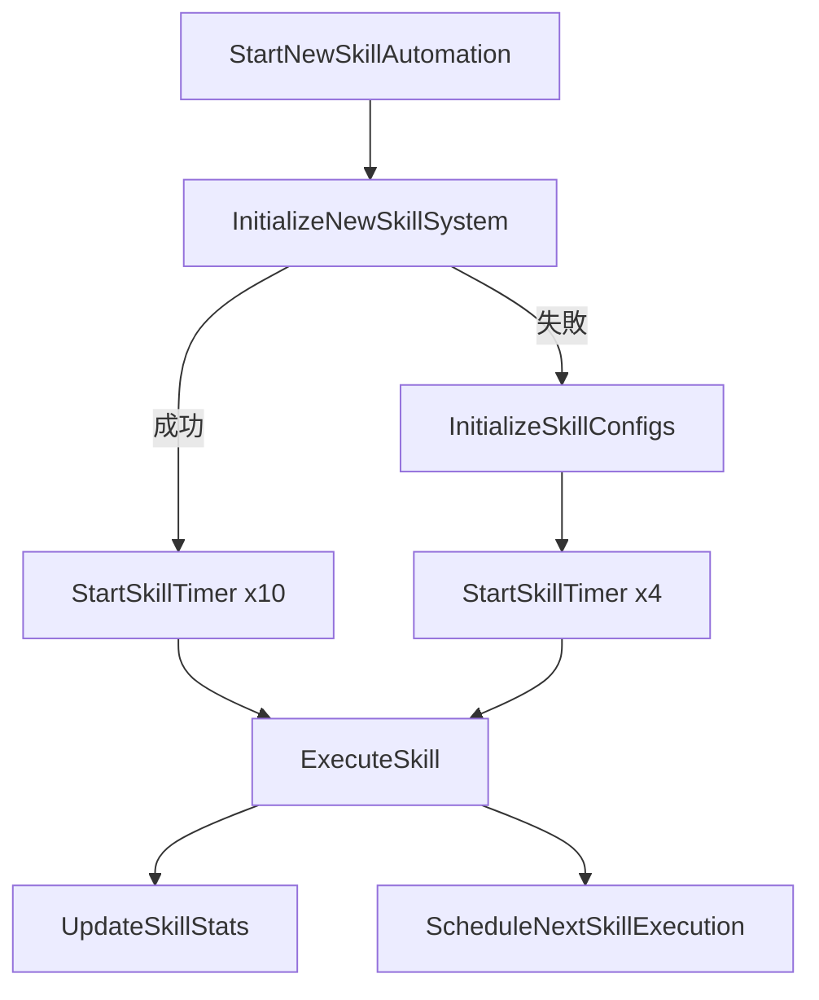
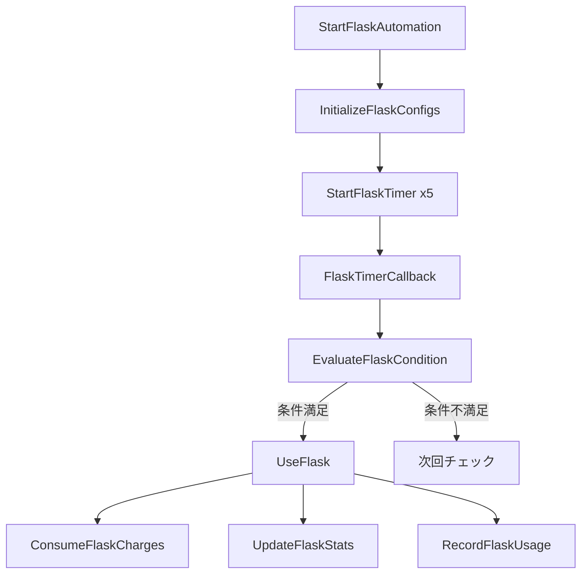
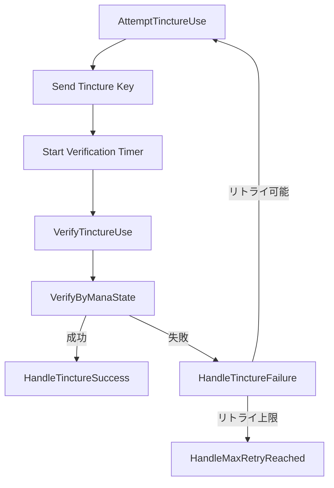

# 関数シグネチャ仕様書

## 概要

Path of Exileマクロの主要モジュール（Skills、Flask、Tincture）における全関数の詳細仕様。シグネチャ、副作用、エラー条件、呼び出し関係を包括的に文書化。

## 目次

1. [スキル自動化システム](#スキル自動化システム)
2. [フラスコ管理システム](#フラスコ管理システム)
3. [ティンクチャー管理システム](#ティンクチャー管理システム)
4. [関数呼び出し関係図](#関数呼び出し関係図)
5. [エラー処理パターン](#エラー処理パターン)

---

## スキル自動化システム

### Features/Skills/SkillConfigurator.ahk

#### `InitializeSkillConfigs()`
```autohotkey
InitializeSkillConfigs() -> None
```
**目的**: レガシースキルシステム（E, R, T, Wine）の初期化

**副作用**:
- `g_skill_configs` Map を設定（4つのスキル）
- `g_skill_enabled` Map を true で初期化
- `InitializeSkillStats()` を呼び出し

**呼び出し関係**:
- **呼び出される**: `StartSkillAutomation()` から
- **呼び出す**: `InitializeSkillStats()`

**エラー条件**: なし（ハードコード値使用）

---

#### `InitializeNewSkillSystem()`
```autohotkey
InitializeNewSkillSystem() -> Boolean
```
**目的**: 新スキルシステム（10スキル対応）の初期化

**引数**: なし

**戻り値**: Boolean - 成功時 true、失敗時 false

**副作用**:
- `g_skill_configs`, `g_skill_enabled`, `g_skill_stats` をクリアして再設定
- ConfigManager から Skill セクション読み込み
- Skill_1_1 ～ Skill_2_5 の10スキルを設定

**呼び出し関係**:
- **呼び出される**: `StartNewSkillAutomation()` から
- **呼び出す**: `ConfigManager.Get()`

**エラー条件**:
- ConfigManager 読み込み失敗時 false を返す
- ログにエラー記録、レガシーシステムへフォールバック

---

#### `ConfigureSkills(skillConfig)`
```autohotkey
ConfigureSkills(skillConfig: Map) -> Boolean
```
**目的**: 実行時のスキル設定動的変更

**引数**:
- `skillConfig`: Map - スキル設定マップ

**戻り値**: Boolean - 設定成功時 true

**副作用**:
- マクロアクティブ時は一時的に停止/再開
- `g_skill_configs`, `g_skill_enabled` を完全置換
- 各スキルの統計情報をリセット

**呼び出し関係**:
- **呼び出す**: `StopSkillAutomation()`, `StartSkillAutomation()`

**エラー条件**:
- タイマー操作失敗時 false を返す
- 無効な設定値は検証でデフォルト値に修正

---

### Features/Skills/SkillController.ahk

#### `StartSkillAutomation()`
```autohotkey
StartSkillAutomation() -> None
```
**目的**: レガシースキル自動化の開始

**副作用**:
- `g_macro_start_time` を現在時刻に設定
- 全スキルタイマーを優先度付きで開始
- Wine システム初期化

**呼び出し関係**:
- **呼び出す**: `InitializeSkillConfigs()`, `InitializeWineSystem()`, `StartSkillTimer()`

**タイマー作成**:
- SkillE_Timer (Priority: Normal)
- SkillR_Timer (Priority: Normal) 
- SkillT_Timer (Priority: Low)
- Wine_Timer (Priority: High)

---

#### `StartNewSkillAutomation()`
```autohotkey
StartNewSkillAutomation() -> Boolean
```
**目的**: 新スキルシステム自動化の開始

**戻り値**: Boolean - 初期化成功時 true

**副作用**:
- 新システム初期化試行
- 失敗時はレガシーシステムにフォールバック
- 統計とWineシステム初期化

**呼び出し関係**:
- **呼び出す**: `InitializeNewSkillSystem()`, フォールバック時は `InitializeSkillConfigs()`

**エラー条件**:
- 新システム初期化失敗時はレガシーシステムで継続

---

#### `StartSkillTimer(skill, config)`
```autohotkey
StartSkillTimer(skill: String, config: Object) -> None
```
**目的**: 個別スキルタイマーの開始

**引数**:
- `skill`: String - スキル名
- `config`: Object - スキル設定オブジェクト

**副作用**:
- `g_skill_timers[skill]` にタイマー名登録
- `g_skill_last_use[skill]` を 0 に初期化
- 優先度に基づく初期遅延でタイマー作成

**呼び出し関係**:
- **呼び出される**: 自動化開始関数から
- **呼び出す**: `StartManagedTimer()`

**遅延計算**:
```autohotkey
priority_delays := Map("High", 100, "Normal", 200, "Low", 300)
initial_delay := priority_delays.Get(config.priority, 200)
```

**エラー条件**:
- タイマー作成失敗時ログ記録、処理継続

---

#### `ExecuteSkill(skill, config)`
```autohotkey
ExecuteSkill(skill: String, config: Object) -> None
```
**目的**: スキル実行の中核処理

**引数**:
- `skill`: String - 実行するスキル名
- `config`: Object - スキル設定

**副作用**:
- `Send(config.key)` でキー送信
- `g_skill_stats[skill]` の統計更新
- `g_skill_last_use[skill]` を現在時刻に更新
- 次回実行のスケジューリング

**呼び出し関係**:
- **呼び出される**: タイマーコールバックから
- **呼び出す**: `UpdateSkillStats()`, `ScheduleNextSkillExecution()`

**実行間隔検証**:
```autohotkey
min_interval_check := (A_TickCount - last_use >= config.min_interval)
```

**エラー条件**:
- Send() 失敗時エラーカウント増加
- 間隔違反時実行スキップ

---

#### `ScheduleNextSkillExecution(skill, config, delay)`
```autohotkey
ScheduleNextSkillExecution(skill: String, config: Object, delay: Integer) -> None
```
**目的**: 次回スキル実行のスケジューリング

**引数**:
- `skill`: String - スキル名
- `config`: Object - スキル設定
- `delay`: Integer - 実行遅延（ミリ秒）

**副作用**:
- 指定遅延で次回実行タイマー作成
- Wine スキルの場合は動的タイミング適用

**呼び出し関係**:
- **呼び出される**: `ExecuteSkill()` から
- **呼び出す**: `StartManagedTimer()`

---

#### `StopSkillTimer(skill)`
```autohotkey
StopSkillTimer(skill: String) -> None
```
**目的**: 個別スキルタイマーの停止

**引数**:
- `skill`: String - 停止するスキル名

**副作用**:
- `g_skill_timers` からエントリ削除
- 管理タイマーの停止

**呼び出し関係**:
- **呼び出す**: `StopManagedTimer()`

---

#### `StopSkillAutomation()`
```autohotkey
StopSkillAutomation() -> None
```
**目的**: 全スキル自動化の停止

**副作用**:
- 全スキルタイマーを停止
- `g_skill_timers` をクリア

**呼び出し関係**:
- **呼び出す**: 各スキルの `StopManagedTimer()`

---

#### `ToggleSkill(skill, enabled)`
```autohotkey
ToggleSkill(skill: String, enabled?: Boolean) -> Boolean
```
**目的**: 個別スキルの有効/無効切り替え

**引数**:
- `skill`: String - 対象スキル名
- `enabled`: Boolean (省略可) - 設定する状態

**戻り値**: Boolean - 操作成功時 true

**副作用**:
- `g_skill_enabled[skill]` の更新
- 有効時タイマー開始、無効時タイマー停止

**エラー条件**:
- 未知のスキル名の場合 false を返す

---

#### `ResetSkillTimings()`
```autohotkey
ResetSkillTimings() -> None
```
**目的**: 全スキルタイミングのリセット

**副作用**:
- 全タイマー停止
- `g_skill_last_use` クリア  
- 有効スキルの再開始

**呼び出し関係**:
- **呼び出す**: `StopSkillAutomation()`, タイマー再作成関数群

---

### Features/Skills/SkillHelpers.ahk

#### `ManualExecuteSkill(skill)`
```autohotkey
ManualExecuteSkill(skill: String) -> Boolean
```
**目的**: 手動スキル実行（テスト用）

**引数**:
- `skill`: String - 実行するスキル名

**戻り値**: Boolean - 実行成功時 true

**副作用**:
- キー送信
- 統計更新

**エラー条件**:
- 未知のスキル、Send() 失敗時 false

---

#### `ValidateSkillConfig(skill, config)`
```autohotkey
ValidateSkillConfig(skill: String, config: Object) -> Array
```
**目的**: スキル設定の検証

**引数**:
- `skill`: String - スキル名
- `config`: Object - 検証する設定

**戻り値**: Array - エラーメッセージの配列（空=正常）

**検証項目**:
- 必須フィールド存在確認
- 数値範囲の妥当性
- 優先度値（1-5）
- 間隔設定（min <= max）

---

#### `SanitizeSkillConfig(config)`
```autohotkey
SanitizeSkillConfig(config: Object) -> Object
```
**目的**: 設定の正規化とデフォルト値適用

**引数**:
- `config`: Object - 元設定オブジェクト

**戻り値**: Object - 正規化された設定

**デフォルト値**:
```autohotkey
defaults := {
    enabled: true,
    min_interval: 1000,
    max_interval: 1100, 
    priority: 3,
    name: "Unknown Skill"
}
```

---

#### `BenchmarkSkillExecution(skill, iterations)`
```autohotkey
BenchmarkSkillExecution(skill: String, iterations?: Integer) -> Object|Boolean
```
**目的**: スキル実行のパフォーマンステスト

**引数**:
- `skill`: String - テスト対象スキル
- `iterations`: Integer (省略可、デフォルト10) - 実行回数

**戻り値**: Object (結果) または Boolean false (エラー時)

**副作用**:
- 指定回数のスキル実行
- 短時間のSleep()呼び出し

**結果オブジェクト**:
```autohotkey
{
    skill: skill_name,
    iterations: count,
    total_time: milliseconds,
    average_time: milliseconds,
    min_time: milliseconds,
    max_time: milliseconds,
    success_rate: percentage
}
```

---

### Features/Skills/SkillStatistics.ahk

#### `UpdateSkillStats(skill)`
```autohotkey
UpdateSkillStats(skill: String) -> None
```
**目的**: スキル統計の更新

**引数**:
- `skill`: String - 更新対象スキル

**副作用**:
- `g_skill_stats[skill]` の以下項目更新:
  - `use_count`: 使用回数
  - `last_use`: 最終使用時刻
  - `total_delay`: 累積遅延
  - `average_delay`: 平均遅延

---

#### `GetSkillPerformanceStats()`
```autohotkey
GetSkillPerformanceStats() -> Object
```
**目的**: 包括的パフォーマンス統計の算出

**戻り値**: Object - パフォーマンス指標

**算出内容**:
```autohotkey
{
    total_skills: count,
    active_skills: count,
    total_executions: sum,
    average_interval: milliseconds,
    priority_distribution: {High: %, Normal: %, Low: %},
    efficiency_score: percentage,
    session_duration: milliseconds
}
```

---

#### `ResetAllSkillStats()`
```autohotkey
ResetAllSkillStats() -> Boolean
```
**目的**: 全スキル統計のリセット

**戻り値**: Boolean - 常に true

**副作用**:
- 全スキルの統計をゼロクリア
- セッション開始時刻をリセット

---

### Features/Skills/WineManager.ahk

#### `ExecuteWineOfProphet()`
```autohotkey
ExecuteWineOfProphet() -> None
```
**目的**: Wine of Prophet スキルの実行

**副作用**:
- Wine キー送信
- ステージベース遅延算出
- 統計更新

**呼び出し関係**:
- **呼び出す**: `GetCurrentWineStage()`, `UpdateSkillStats()`, `ScheduleNextSkillExecution()`

**動的タイミング**:
```autohotkey
stage_timings := [
    {duration: 6000, interval: {min: 4800, max: 4900}},   // Stage 1
    {duration: 6000, interval: {min: 4100, max: 4200}},   // Stage 2
    {duration: 6000, interval: {min: 3900, max: 4000}},   // Stage 3
    {duration: 0, interval: {min: 3700, max: 3800}}       // Stage 4+
]
```

**エラー条件**:
- Send() 失敗時エラーカウント増加

---

#### `GetCurrentWineStage(elapsedTime)`
```autohotkey
GetCurrentWineStage(elapsedTime: Integer) -> Object
```
**目的**: 経過時間に基づくWineステージ算出

**引数**:
- `elapsedTime`: Integer - マクロ開始からの経過時間（ミリ秒）

**戻り値**: Object - ステージ情報

**戻り値構造**:
```autohotkey
{
    stage: integer,                    // 現在ステージ (1-4)
    stage_elapsed: integer,           // ステージ内経過時間
    stage_duration: integer,          // ステージ持続時間
    next_interval: {min: int, max: int}, // 次回実行間隔
    stage_progress: float             // ステージ進捗率 (0.0-1.0)
}
```

---

#### `ResetWineTimer()`
```autohotkey
ResetWineTimer() -> Boolean
```
**目的**: Wine タイマーのリセット

**戻り値**: Boolean - 操作成功時 true

**副作用**:
- Wineステージを1にリセット
- マクロ開始時刻更新
- タイマー再作成

**エラー条件**:
- タイマー操作失敗時 false

---

## フラスコ管理システム

### Features/Flask/FlaskController.ahk

#### `StartFlaskAutomation()`
```autohotkey
StartFlaskAutomation() -> None
```
**目的**: フラスコ自動化システムの開始

**副作用**:
- `g_flask_timer_active` を true に設定
- 全フラスコの初期化と統計リセット
- 有効フラスコのタイマー開始

**呼び出し関係**:
- **呼び出す**: `InitializeFlaskConfigs()`, `ResetFlaskStats()`, `StartFlaskTimer()`

**タイマー作成**: 設定済み各フラスコ用の個別タイマー

---

#### `StartFlaskTimer(flaskName, config)`
```autohotkey
StartFlaskTimer(flaskName: String, config: Object) -> Boolean
```
**目的**: 個別フラスコタイマーの開始

**引数**:
- `flaskName`: String - フラスコ名
- `config`: Object - フラスコ設定

**戻り値**: Boolean - 開始成功時 true

**副作用**:
- `g_flask_timer_handles[flaskName]` にタイマー登録
- `g_flask_active_flasks[flaskName]` を true に設定
- 条件チェック後即座実行または遅延開始

**呼び出し関係**:
- **呼び出す**: `EvaluateFlaskCondition()`, `UseFlask()`, `RetryFlaskStart()`

**条件評価**:
- 使用条件が満たされない場合は `RetryFlaskStart()` で再試行

**エラー条件**:
- 条件未達成時や使用失敗時 false

---

#### `UseFlask(flaskName, config)`
```autohotkey
UseFlask(flaskName: String, config: Object) -> Boolean
```
**目的**: フラスコ使用の中核処理

**引数**:
- `flaskName`: String - 使用するフラスコ名
- `config`: Object - フラスコ設定

**戻り値**: Boolean - 使用成功時 true

**副作用**:
- `Send(config.key)` でキー送信
- チャージ消費（`ConsumeFlaskCharges()`）
- 使用統計更新
- `g_flask_last_use_time[flaskName]` 更新

**呼び出し関係**:
- **呼び出す**: `ConsumeFlaskCharges()`, `UpdateFlaskStats()`, `RecordFlaskUsage()`

**検証項目**:
```autohotkey
// 間隔チェック
time_since_last := A_TickCount - g_flask_last_use_time[flaskName]
interval_valid := time_since_last >= config.min_interval

// チャージチェック  
charges_available := ValidateFlaskCharges(flaskName, 1)
```

**エラー条件**:
- 間隔違反、チャージ不足、Send()失敗時 false

---

#### `FlaskTimerCallback(flaskName)`
```autohotkey
FlaskTimerCallback(flaskName: String) -> None
```
**目的**: フラスコタイマーのコールバック関数

**引数**:
- `flaskName`: String - 実行対象フラスコ

**副作用**:
- マクロ非アクティブ時はタイマー停止
- 条件チェック後フラスコ使用
- 次回実行のスケジューリング

**スケジューリング**:
```autohotkey
next_interval := Random(config.min_interval, config.max_interval)
StartManagedTimer("Flask_" . flaskName, next_interval, FlaskTimerCallback.Bind(flaskName))
```

---

#### `StopFlaskAutomation()`
```autohotkey
StopFlaskAutomation() -> None
```
**目的**: 全フラスコ自動化の停止

**副作用**:
- 全フラスコタイマー停止
- `g_flask_timer_handles`, `g_flask_active_flasks` クリア
- `g_flask_timer_active` を false に設定

---

#### `PauseFlaskAutomation()` / `ResumeFlaskAutomation()`
```autohotkey
PauseFlaskAutomation() -> None
ResumeFlaskAutomation() -> None
```
**目的**: フラスコ自動化の一時停止/再開

**副作用**:
- `g_flask_automation_paused` フラグ設定
- 一時停止中はタイマーコールバックで処理スキップ

---

### Features/Flask/FlaskConfiguration.ahk

#### `InitializeFlaskConfigs()`
```autohotkey
InitializeFlaskConfigs() -> None
```
**目的**: デフォルトフラスコ設定の初期化

**副作用**:
- `g_flask_configs` にデフォルト5フラスコ設定
- チャージトラッカー初期化

**デフォルト設定例**:
```autohotkey
Flask1 := {
    name: "ライフフラスコ",
    key: "1",
    enabled: true,
    type: "Life",
    min_interval: 4500,
    max_interval: 4800,
    priority: "High",
    condition: "IsLowHealth",
    auto_use: true
}
```

**呼び出し関係**:
- **呼び出す**: `InitializeChargeTracker()`

---

#### `ConfigureFlasks(flaskConfig)`
```autohotkey
ConfigureFlasks(flaskConfig: Map) -> Boolean
```
**目的**: フラスコ設定の包括的更新

**引数**:
- `flaskConfig`: Map - 新しいフラスコ設定マップ

**戻り値**: Boolean - 設定成功時 true

**副作用**:
- フラスコ自動化の一時停止/再開
- `g_flask_configs` の完全置換
- チャージトラッカーの再初期化

**エラー条件**:
- 自動化停止/開始失敗時 false

---

#### `ToggleFlask(flaskName, enabled)`
```autohotkey
ToggleFlask(flaskName: String, enabled?: Boolean) -> Boolean
```
**目的**: 個別フラスコの有効/無効切り替え

**引数**:
- `flaskName`: String - 対象フラスコ名
- `enabled`: Boolean (省略可) - 設定状態

**戻り値**: Boolean - 操作成功時 true

**副作用**:
- `g_flask_configs[flaskName].enabled` 更新
- 有効時タイマー開始、無効時停止

---

#### `LoadFlaskConfigFromINI()`
```autohotkey
LoadFlaskConfigFromINI() -> Boolean
```
**目的**: Config.ini からフラスコ設定読み込み

**戻り値**: Boolean - 読み込み成功時 true

**副作用**:
- ConfigManager から Flask セクション読み込み
- `g_flask_configs` 更新

**設定キー例**:
```ini
[Flask]
Flask1_Name=ライフフラスコ
Flask1_Key=1
Flask1_Enabled=true
Flask1_Type=Life
Flask1_MinInterval=4500
Flask1_MaxInterval=4800
```

---

### Features/Flask/FlaskChargeManager.ahk

#### `ConsumeFlaskCharges(flaskName, amount)`
```autohotkey
ConsumeFlaskCharges(flaskName: String, amount: Integer) -> Boolean
```
**目的**: フラスコチャージの消費

**引数**:
- `flaskName`: String - 対象フラスコ
- `amount`: Integer - 消費チャージ数

**戻り値**: Boolean - 消費成功時 true

**副作用**:
- `g_flask_charge_tracker[flaskName].current` からチャージ減算
- 最終使用時刻更新

**エラー条件**:
- チャージ不足時 false

---

#### `ValidateFlaskCharges(flaskName, requiredCharges)`
```autohotkey
ValidateFlaskCharges(flaskName: String, requiredCharges: Integer) -> Boolean
```
**目的**: チャージ十分性の確認

**引数**:
- `flaskName`: String - チェック対象フラスコ
- `requiredCharges`: Integer - 必要チャージ数

**戻り値**: Boolean - 十分なチャージがある場合 true

**副作用**: なし（読み取り専用）

---

#### `UpdateFlaskCharges()`
```autohotkey
UpdateFlaskCharges() -> None
```
**目的**: 時間経過によるチャージ回復

**副作用**:
- 全フラスコのチャージを時間に基づいて回復
- 最大値を超えないよう制限

**回復計算**:
```autohotkey
time_passed := A_TickCount - tracker.last_update
charges_gained := Floor(time_passed / charge_recovery_rate)
new_charges := Min(current + charges_gained, max_charges)
```

---

### Features/Flask/FlaskConditions.ahk

#### `EvaluateFlaskCondition(flaskName, config)`
```autohotkey
EvaluateFlaskCondition(flaskName: String, config: Object) -> Boolean
```
**目的**: フラスコ使用条件の評価

**引数**:
- `flaskName`: String - 評価対象フラスコ
- `config`: Object - フラスコ設定

**戻り値**: Boolean - 使用条件が満たされている場合 true

**副作用**:
- 条件評価のパフォーマンス統計更新

**条件例**:
- Life フラスコ: `IsLowHealth(70)`
- Mana フラスコ: `IsLowMana(50)`
- Quicksilver: `ShouldUseQuicksilver()`

---

#### `IsLowHealth(threshold)` / `IsLowMana(threshold)`
```autohotkey
IsLowHealth(threshold?: Integer) -> Boolean
IsLowMana(threshold?: Integer) -> Boolean
```
**目的**: ヘルス/マナ残量チェック

**引数**:
- `threshold`: Integer (省略可) - 閾値パーセンテージ

**戻り値**: Boolean - 閾値未満の場合 true

**注意**: 現在はプレースホルダー実装（常に false）

---

#### `RegisterConditionFunction(name, func)`
```autohotkey
RegisterConditionFunction(name: String, func: Function) -> None
```
**目的**: カスタム条件関数の登録

**引数**:
- `name`: String - 条件名
- `func`: Function - 評価関数

**副作用**:
- `g_condition_functions[name]` に関数登録

---

### Features/Flask/FlaskStatistics.ahk

#### `UpdateFlaskStats(flaskName)`
```autohotkey
UpdateFlaskStats(flaskName?: String) -> None
```
**目的**: フラスコ使用統計の更新

**引数**:
- `flaskName`: String (省略可) - 対象フラスコ（省略時は全体統計）

**副作用**:
- `g_flask_stats` のグローバル統計更新
- 個別フラスコ統計更新

---

#### `RecordFlaskUsage(flaskName, success, errorMsg)`
```autohotkey
RecordFlaskUsage(flaskName: String, success?: Boolean, errorMsg?: String) -> None
```
**目的**: フラスコ使用履歴の記録

**引数**:
- `flaskName`: String - 使用フラスコ名
- `success`: Boolean (省略可、デフォルトtrue) - 成功フラグ
- `errorMsg`: String (省略可) - エラーメッセージ

**副作用**:
- `g_flask_usage_history` に履歴エントリ追加
- 最大エントリ数（100）を超える古いエントリ削除

**履歴エントリ構造**:
```autohotkey
{
    timestamp: A_TickCount,
    flask: flaskName,
    success: success,
    error: errorMsg,
    charges_before: previous_charges,
    charges_after: current_charges
}
```

---

#### `GetFlaskPerformanceStats()`
```autohotkey
GetFlaskPerformanceStats() -> Object
```
**目的**: フラスコシステムパフォーマンス統計

**戻り値**: Object - パフォーマンス指標

**統計内容**:
```autohotkey
{
    total_flasks: count,
    active_flasks: count,
    total_uses: sum,
    success_rate: percentage,
    average_interval: milliseconds,
    efficiency_score: percentage,
    charge_utilization: percentage
}
```

---

## ティンクチャー管理システム

### Features/TinctureManager.ahk

#### `InitialTinctureUse()`
```autohotkey
InitialTinctureUse() -> None
```
**目的**: ティンクチャーの初回使用

**副作用**:
- ティンクチャーキー送信
- `g_tincture_active` を true に設定
- 使用履歴と統計の記録

**呼び出し関係**:
- **呼び出す**: `Send()`, `RecordTinctureUse()`, パフォーマンス計測

**エラー条件**:
- Send() 失敗時は `g_tincture_active` を false に設定

---

#### `AttemptTinctureUse()`
```autohotkey
AttemptTinctureUse() -> None
```
**目的**: ティンクチャー使用試行（リトライ対応）

**副作用**:
- `g_tincture_retry_count` 増加
- ティンクチャーキー送信
- 検証タイマーとタイムアウトタイマー開始
- 統計記録

**呼び出し関係**:
- **呼び出す**: `Send()`, `StartManagedTimer()`, `HandleMaxRetryReached()`

**リトライロジック**:
```autohotkey
if (g_tincture_retry_count >= g_tincture_retry_max) {
    HandleMaxRetryReached()
    return
}
```

**タイマー作成**:
- Verification タイマー: 100ms 後に効果検証
- Timeout タイマー: 1000ms 後にタイムアウト処理

---

#### `VerifyTinctureUse()`
```autohotkey
VerifyTinctureUse() -> None
```
**目的**: ティンクチャー効果の検証

**副作用**:
- タイムアウトタイマー停止
- 検証方法に基づく成功/失敗判定
- 成功/失敗ハンドラー呼び出し

**呼び出し関係**:
- **呼び出す**: `VerifyByManaState()`, `VerifyByBuffIcon()`, `HandleTinctureSuccess()`, `HandleTinctureFailure()`

**検証方法**:
```autohotkey
verification_result := false
switch g_tincture_verification_method {
    case "mana": verification_result := VerifyByManaState()
    case "buff": verification_result := VerifyByBuffIcon()
}
```

---

#### `VerifyByManaState()`
```autohotkey
VerifyByManaState() -> Boolean
```
**目的**: マナ状態によるティンクチャー検証

**戻り値**: Boolean - ティンクチャーがアクティブと判定される場合 true

**呼び出し関係**:
- **呼び出す**: `CheckManaRadial()`

**判定ロジック**:
- マナオーブの色を確認
- ティンクチャー効果による色変化を検出

---

#### `HandleTinctureSuccess()`
```autohotkey
HandleTinctureSuccess() -> None
```
**目的**: ティンクチャー成功時の処理

**副作用**:
- `g_tincture_active` を true に設定
- `g_tincture_retry_count` をリセット
- 関連タイマーの停止
- フラスコタイミングのリセット
- 成功統計の更新

**呼び出し関係**:
- **呼び出す**: `CleanupTinctureTimers()`, `ResetFlaskTiming()`, `RecordTinctureUse()`

---

#### `HandleTinctureFailure()`
```autohotkey
HandleTinctureFailure() -> None
```
**目的**: ティンクチャー失敗時の処理

**副作用**:
- 失敗統計の記録
- リトライ上限チェック
- 条件満足時の再試行

**呼び出し関係**:
- **呼び出す**: `RecordTinctureUse()`, 条件によって `AttemptTinctureUse()`

**リトライ条件**:
```autohotkey
can_retry := (g_tincture_retry_count < g_tincture_retry_max)
mana_available := (g_mana_fill_rate > 30)
```

---

#### `HandleTinctureOnManaDepletion()`
```autohotkey
HandleTinctureOnManaDepletion() -> None
```
**目的**: マナ枯渇時のティンクチャー無効化

**副作用**:
- `g_tincture_active` を false に設定
- クールダウン時刻設定
- 関連タイマーのクリーンアップ
- クールダウンチェック開始

**呼び出し関係**:
- **呼び出す**: `CleanupTinctureTimers()`, `StartTinctureCooldownCheck()`

---

#### `CheckTinctureCooldown()`
```autohotkey
CheckTinctureCooldown() -> None
```
**目的**: ティンクチャークールダウンの定期チェック

**副作用**:
- クールダウン完了時に使用試行開始
- ステータスオーバーレイ更新

**呼び出し関係**:
- **呼び出す**: `AttemptTinctureUse()`, `UpdateStatusOverlay()`

**クールダウンチェック**:
```autohotkey
cooldown_remaining := g_tincture_cooldown_end - A_TickCount
if (cooldown_remaining <= 0) {
    // クールダウン完了
}
```

---

#### `ResetTinctureState()`
```autohotkey
ResetTinctureState() -> None
```
**目的**: ティンクチャー状態の完全リセット

**副作用**:
- 全ティンクチャー状態変数をリセット
- 全関連タイマー停止
- 履歴を最新10エントリに制限

**リセット対象変数**:
```autohotkey
g_tincture_active := false
g_tincture_cooldown_end := 0
g_tincture_retry_count := 0
g_tincture_verification_pending := false
g_tincture_last_use_time := 0
g_tincture_retry_timer_active := false
```

---

#### `GetTinctureStatus()`
```autohotkey
GetTinctureStatus() -> Object
```
**目的**: ティンクチャーシステムの包括的状態取得

**戻り値**: Object - 完全な状態情報

**状態オブジェクト構造**:
```autohotkey
{
    active: g_tincture_active,
    cooldown_end: g_tincture_cooldown_end,
    cooldown_remaining: calculated_remaining,
    retry_count: g_tincture_retry_count,
    retry_max: g_tincture_retry_max,
    verification_pending: g_tincture_verification_pending,
    verification_method: g_tincture_verification_method,
    last_use_time: g_tincture_last_use_time,
    success_count: g_tincture_success_count,
    failure_count: g_tincture_failure_count,
    total_attempts: g_tincture_total_attempts,
    success_rate: calculated_percentage,
    history_entries: g_tincture_history.Length
}
```

---

#### `RecordTinctureUse(type, success)`
```autohotkey
RecordTinctureUse(type: String, success: Boolean) -> None
```
**目的**: ティンクチャー使用の履歴記録

**引数**:
- `type`: String - 操作タイプ（"initial", "retry", "verify"）
- `success`: Boolean - 成功フラグ

**副作用**:
- `g_tincture_history` に履歴エントリ追加
- 統計カウンター更新
- 履歴サイズ制限（最大50エントリ）

**履歴エントリ構造**:
```autohotkey
{
    timestamp: A_TickCount,
    type: type,
    success: success,
    retry_count: g_tincture_retry_count,
    verification_method: g_tincture_verification_method,
    mana_state: current_mana_percentage
}
```

---

#### `ForceTinctureStop()`
```autohotkey
ForceTinctureStop() -> None
```
**目的**: ティンクチャーシステムの強制停止

**副作用**:
- 全ティンクチャー関連タイマー即座停止
- アクティブ状態強制無効化
- ログに強制停止記録

**用途**: 緊急時やデバッグ時の完全停止

---

## 関数呼び出し関係図

### スキルシステム初期化フロー


### フラスコシステム実行フロー


### ティンクチャーリトライフロー


---

## エラー処理パターン

### 共通エラー処理戦略

#### 1. グレースフル劣化
```autohotkey
// 例: スキル実行時のSend()失敗
try {
    Send(config.key)
    UpdateSkillStats(skill)
} catch Error as e {
    LogError("SkillController", "Send failed for " . skill . ": " . e.message)
    // 統計のエラーカウント増加、処理継続
    g_skill_stats[skill].error_count++
}
```

#### 2. リトライメカニズム
```autohotkey
// 例: ティンクチャーのリトライ
if (g_tincture_retry_count < g_tincture_retry_max) {
    g_tincture_retry_count++
    // 指数バックオフで再試行
    retry_delay := 1000 * (2 ** g_tincture_retry_count)
    StartManagedTimer("TinctureRetry", retry_delay, AttemptTinctureUse)
}
```

#### 3. フォールバック
```autohotkey
// 例: 新スキルシステム初期化失敗時
if (!InitializeNewSkillSystem()) {
    LogWarn("SkillController", "New skill system failed, falling back to legacy")
    InitializeSkillConfigs()  // レガシーシステムで継続
}
```

### モジュール別エラー条件

#### スキルシステム
- **Send() 失敗**: エラーカウント増加、次回実行継続
- **間隔違反**: 実行スキップ、警告ログ
- **設定読み込み失敗**: デフォルト値使用、レガシーフォールバック

#### フラスコシステム  
- **チャージ不足**: 使用スキップ、チャージ回復待機
- **条件未達成**: 遅延後再評価
- **タイマー作成失敗**: エラーログ、他フラスコ継続

#### ティンクチャーシステム
- **使用失敗**: リトライカウント増加、再試行
- **検証タイムアウト**: 失敗扱い、リトライ判定
- **最大リトライ到達**: 延長クールダウン、状態リセット

---

## 補足事項

### パフォーマンス考慮事項
- **タイマー精度**: 最小間隔100ms、通常1000ms以上
- **統計更新**: 即座更新vs.バッチ処理のバランス
- **メモリ管理**: 履歴配列の最大サイズ制限

### 拡張性設計
- **プラガブル条件システム**: 新条件の動的登録
- **設定検証フレームワーク**: 統一された検証API
- **統計エクスポート**: 外部ツール連携対応

### デバッグサポート
- **包括的ログ**: 全主要操作のトレース
- **状態ダンプ**: システム状態の完全出力
- **パフォーマンス計測**: 実行時間とボトルネック特定