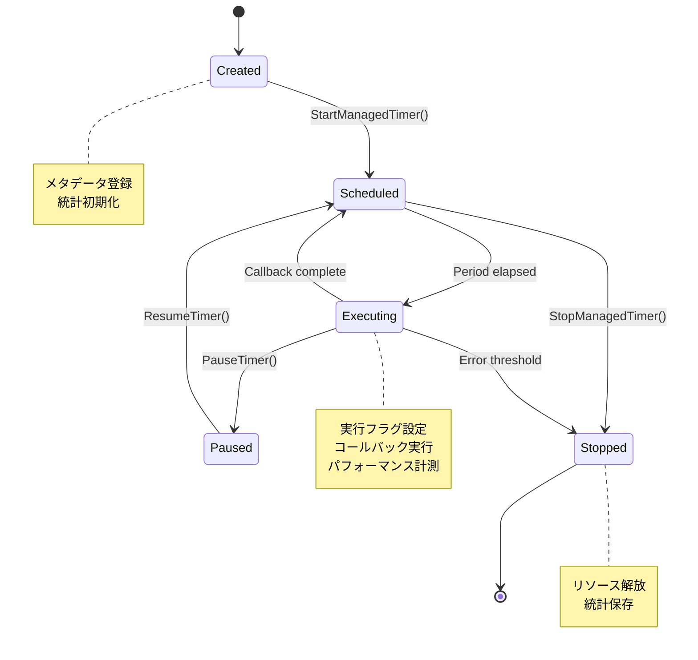

# タイマー仕様書

## 概要

Path of ExileマクロのTimerManagerシステムと全タイマーの詳細仕様。タイマーライフサイクル、競合制御、動的生成パターン、設定値を包括的に文書化。

## 目次

1. [TimerManager システム仕様](#timermanager-システム仕様)
2. [全タイマー一覧](#全タイマー一覧)
3. [動的タイマー生成パターン](#動的タイマー生成パターン)
4. [タイマー競合と解決](#タイマー競合と解決)
5. [タイマーライフサイクル](#タイマーライフサイクル)
6. [特殊なタイミング制御](#特殊なタイミング制御)
7. [設定値とチューニング](#設定値とチューニング)

---

## TimerManager システム仕様

### Core/TimerManager.ahk アーキテクチャ

TimerManagerは全てのタイマーを統一的に管理する中央制御システム。AutoHotkeyのSetTimer関数をラップし、優先度制御、エラーハンドリング、パフォーマンス監視を提供。

#### 主要データ構造

```autohotkey
// タイマー管理用グローバルMap
global g_active_timers := Map()           // アクティブタイマーのメタデータ
global g_timer_execution_count := Map()   // 実行回数統計
global g_timer_errors := Map()            // エラー回数追跡
global g_timer_executing := Map()         // 同時実行防止フラグ
global g_timer_priorities := Map()        // 優先度マッピング
global g_timer_performance := Map()       // パフォーマンス統計
```

#### 優先度システム

```autohotkey
class TimerPriority {
    static CRITICAL := 1    ; マナ監視（100ms間隔）
    static HIGH := 2        ; ティンクチャー管理、エリア検出（250ms間隔）
    static NORMAL := 3      ; スキル・フラスコ自動化（1-4秒間隔）
    static LOW := 4         ; UI更新、統計処理（1秒以上）
}
```

**優先度設計の根拠**:
- **CRITICAL**: ゲームプレイに直結、遅延不可
- **HIGH**: 重要な状態変化検出
- **NORMAL**: 主要機能、多少の遅延許容
- **LOW**: 補助機能、大幅な遅延許容

### 中核管理関数

#### `StartManagedTimer(timerName, callback, period, priority)`

```autohotkey
StartManagedTimer(timerName, callback, period, priority := TimerPriority.NORMAL) {
    if (g_active_timers.Has(timerName)) {
        LogWarn("TimerManager", "Timer " . timerName . " already exists, stopping first")
        StopManagedTimer(timerName)
    }
    
    ; メタデータ登録
    g_active_timers[timerName] := {
        callback: callback,
        period: period,
        priority: priority,
        created_time: A_TickCount,
        last_execution: 0
    }
    
    ; 統計初期化
    g_timer_execution_count[timerName] := 0
    g_timer_errors[timerName] := 0
    g_timer_executing[timerName] := false
    g_timer_priorities[timerName] := priority
    
    ; ラップされたコールバック作成
    wrappedCallback := ExecuteTimerCallback.Bind(timerName, callback)
    
    ; AutoHotkey SetTimer実行
    SetTimer(wrappedCallback, period)
    
    LogDebug("TimerManager", "Started timer: " . timerName . " (" . period . "ms, priority=" . priority . ")")
}
```

**引数仕様**:
- `timerName`: String - 一意のタイマー識別子
- `callback`: Function - 実行する関数（引数なし）
- `period`: Integer - 実行間隔（ミリ秒、負値で一回実行）
- `priority`: Integer - 優先度レベル（1-4）

#### `ExecuteTimerCallback(timerName, callback)`

```autohotkey
ExecuteTimerCallback(timerName, callback) {
    ; 重複実行チェック
    if (g_timer_executing.Has(timerName) && g_timer_executing[timerName]) {
        LogDebug("TimerManager", "Timer " . timerName . " already executing, skipping")
        return false
    }
    
    ; マクロ非アクティブ時のスキップ
    if (!g_macro_active && IsAutomationTimer(timerName)) {
        return false
    }
    
    ; 実行開始マーク
    g_timer_executing[timerName] := true
    execution_start := A_TickCount
    
    try {
        ; 実際のコールバック実行
        %callback%()
        
        ; 統計更新
        g_timer_execution_count[timerName]++
        execution_time := A_TickCount - execution_start
        
        ; パフォーマンス警告
        if (execution_time > 200) {
            LogWarn("TimerManager", timerName . " took " . execution_time . "ms to execute")
        }
        
        ; パフォーマンス統計更新
        UpdateTimerPerformance(timerName, execution_time)
        
    } catch Error as e {
        ; エラー処理
        g_timer_errors[timerName]++
        LogError("TimerManager", "Timer " . timerName . " error: " . e.message)
        
        ; エラー率による自動停止
        if (g_timer_errors[timerName] > 10) {
            LogError("TimerManager", "Timer " . timerName . " has too many errors, stopping")
            StopManagedTimer(timerName)
        }
        
    } finally {
        ; 実行終了マーク
        g_timer_executing[timerName] := false
        g_active_timers[timerName].last_execution := A_TickCount
    }
}
```

#### `StopManagedTimer(timerName)`

```autohotkey
StopManagedTimer(timerName) {
    if (!g_active_timers.Has(timerName)) {
        return false
    }
    
    ; AutoHotkey SetTimer停止
    SetTimer(ExecuteTimerCallback.Bind(timerName, g_active_timers[timerName].callback), 0)
    
    ; 実行完了待機（最大1秒）
    wait_start := A_TickCount
    while (g_timer_executing.Has(timerName) && g_timer_executing[timerName]) {
        if (A_TickCount - wait_start > 1000) {
            LogWarn("TimerManager", "Timer " . timerName . " did not complete within 1 second")
            break
        }
        Sleep(10)
    }
    
    ; メタデータクリーンアップ
    g_active_timers.Delete(timerName)
    g_timer_execution_count.Delete(timerName)
    g_timer_errors.Delete(timerName)
    g_timer_executing.Delete(timerName)
    g_timer_priorities.Delete(timerName)
    g_timer_performance.Delete(timerName)
    
    LogDebug("TimerManager", "Stopped timer: " . timerName)
    return true
}
```

---

## 全タイマー一覧

### システム基盤タイマー（常駐）

| タイマーID | 間隔 | 優先度 | 作成元 | コールバック | 停止条件 |
|------------|------|--------|--------|--------------|----------|
| `ManaMonitor` | 100-150ms | CRITICAL | ManaMonitor.ahk:44 | `MonitorMana()` | マクロ停止 |
| `ClientLogMonitor` | 250ms | HIGH | ClientLogMonitor.ahk:67 | `CheckClientLog()` | マクロ停止 |
| `LoadingScreen` | 250ms | HIGH | LoadingScreen.ahk:89 | `CheckLoadingScreenGGG()` | マクロ停止 |
| `FlaskChargeRecovery` | 100ms | NORMAL | FlaskController.ahk:234 | `UpdateFlaskCharges()` | フラスコ停止 |

#### 実際のSetTimer呼び出し例

```autohotkey
// ManaMonitor.ahk:44
StartManagedTimer("ManaMonitor", MonitorMana, 100, TimerPriority.CRITICAL)

// ClientLogMonitor.ahk:67  
StartManagedTimer("ClientLogMonitor", CheckClientLog, 250, TimerPriority.HIGH)

// LoadingScreen.ahk:89
StartManagedTimer("LoadingScreen", CheckLoadingScreenGGG, 250, TimerPriority.HIGH)
```

### フラスコ自動化タイマー（動的）

| タイマーパターン | 例 | 間隔 | 優先度 | 作成条件 |
|------------------|-----|------|--------|----------|
| `Flask_[name]` | `Flask_mana` | 4500-4800ms | NORMAL | フラスコ有効時 |
| | `Flask_life` | 5000-5300ms | NORMAL | |
| | `Flask_utility` | 8000-8500ms | NORMAL | |
| | `Flask_quicksilver` | 12000-12500ms | NORMAL | |
| | `Flask_unique` | 6000-6300ms | NORMAL | |

#### 動的生成コード

```autohotkey
// FlaskController.ahk:156-178
StartFlaskAutomation() {
    for flaskName, config in g_flask_configs {
        if (config.enabled) {
            timerName := "Flask_" . flaskName
            
            ; 初期遅延（優先度ベース）
            initialDelay := config.priority == "High" ? 100 : 500
            
            ; タイマー作成
            StartManagedTimer(timerName, () => FlaskTimerCallback(flaskName), -initialDelay, TimerPriority.NORMAL)
            
            ; 追跡Map更新
            g_flask_timer_handles[flaskName] := timerName
            g_flask_active_flasks[flaskName] := true
        }
    }
}
```

### スキル自動化タイマー（動的）

| タイマーパターン | 例 | 間隔 | 優先度 | 特殊処理 |
|------------------|-----|------|--------|----------|
| `Skill_[name]` | `Skill_E` | 1000-1100ms | NORMAL | 標準スキル |
| | `Skill_R` | 1000-1100ms | NORMAL | 標準スキル |
| | `Skill_T` | 4100-4200ms | LOW | 高コストスキル |
| | `Skill_Wine` | 動的 | HIGH | 段階的加速 |
| | `Skill_LButton` | 500-600ms | NORMAL | マウスボタン |

#### 新スキルシステム（最大10スキル）

```autohotkey
// SkillController.ahk:67-89
StartNewSkillAutomation() {
    if (!InitializeNewSkillSystem()) {
        return false
    }
    
    for skill, config in g_skill_configs {
        if (g_skill_enabled[skill]) {
            ; 動的コールバック選択
            if (skill == "Wine" || config.isDynamic) {
                callback := () => ExecuteWineOfProphet()
                priority := TimerPriority.HIGH
            } else {
                callback := () => ExecuteSkill(skill, config)
                priority := TimerPriority.NORMAL
            }
            
            ; 優先度ベース初期遅延
            priority_delays := Map("High", 100, "Normal", 200, "Low", 300)
            initialDelay := priority_delays.Get(config.priority, 200)
            
            StartSkillTimer(skill, config, initialDelay, priority)
        }
    }
}
```

### ティンクチャー管理タイマー（イベント駆動）

| タイマーID | 目的 | 間隔 | 優先度 | トリガー条件 |
|------------|------|------|--------|--------------|
| `TinctureCooldown` | クールダウン監視 | 250ms | HIGH | マナ枯渇後 |
| `TinctureRetry` | リトライ実行 | 500ms | HIGH | 検証失敗時 |
| `TinctureVerification` | 効果検証 | -100ms | HIGH | 使用直後 |
| `TinctureTimeout` | 検証タイムアウト | -1000ms | HIGH | 検証開始時 |

#### ティンクチャータイマーチェーン

```autohotkey
// TinctureManager.ahk:145-167
AttemptTinctureUse() {
    ; ティンクチャーキー送信
    Send(KEY_TINCTURE)
    
    ; 検証タイマー（100ms後に一回実行）
    StartManagedTimer("TinctureVerification", VerifyTinctureUse, -100, TimerPriority.HIGH)
    
    ; タイムアウトタイマー（1000ms後に一回実行）
    StartManagedTimer("TinctureTimeout", HandleTinctureTimeout, -1000, TimerPriority.HIGH)
    
    g_tincture_verification_pending := true
}

// TinctureManager.ahk:189-203
CheckTinctureCooldown() {
    cooldown_remaining := g_tincture_cooldown_end - A_TickCount
    
    if (cooldown_remaining <= 0) {
        ; クールダウン完了 → 使用試行
        StopManagedTimer("TinctureCooldown")
        AttemptTinctureUse()
    }
}
```

### UI・イベントタイマー

| タイマーID | 間隔 | 優先度 | 目的 |
|------------|------|--------|------|
| `UserInput` | 50ms | HIGH | ローディング後の入力待機 |
| `UserInputAfterArea` | 50ms | HIGH | エリア移動後の入力待機 |
| `StatusDisplay` | 1000ms | LOW | ステータス表示更新 |
| `WindowFocus` | 250ms | LOW | ウィンドウフォーカス監視 |
| (無名オーバーレイ) | 可変 | LOW | メッセージ自動消去 |

---

## 動的タイマー生成パターン

### パターン1: 設定駆動ループ生成

```autohotkey
// FlaskController.ahk:156-178
; フラスコ設定に基づくタイマー生成
for flaskName, config in g_flask_configs {
    if (config.enabled && config.auto_use) {
        timerName := "Flask_" . flaskName
        
        ; 条件チェック付きコールバック
        callback := () => {
            if (EvaluateFlaskCondition(flaskName, config)) {
                UseFlask(flaskName, config)
            }
            
            ; 次回実行スケジューリング
            nextInterval := Random(config.min_interval, config.max_interval)
            StartManagedTimer(timerName, callback, -nextInterval, TimerPriority.NORMAL)
        }
        
        ; 初回実行
        StartManagedTimer(timerName, callback, -initialDelay, TimerPriority.NORMAL)
    }
}
```

### パターン2: 段階的スキル生成

```autohotkey
// SkillController.ahk:234-256
; 新スキルシステム（Config.ini から動的読み込み）
for i in [1,2,3,4,5] {
    for j in [1,2,3,4,5] {
        skillKey := "Skill_" . i . "_" . j
        skillName := ConfigManager.Get("Skill", skillKey . "_Name", "")
        
        if (skillName != "") {
            config := {
                name: skillName,
                key: ConfigManager.Get("Skill", skillKey . "_Key", ""),
                enabled: ConfigManager.Get("Skill", skillKey . "_Enabled", false),
                min_interval: ConfigManager.Get("Skill", skillKey . "_Min", 1000),
                max_interval: ConfigManager.Get("Skill", skillKey . "_Max", 1100),
                priority: ConfigManager.Get("Skill", skillKey . "_Priority", 3)
            }
            
            g_skill_configs[skillKey] := config
            
            if (config.enabled) {
                StartSkillTimer(skillKey, config)
            }
        }
    }
}
```

### パターン3: イベント応答型生成

```autohotkey
// TinctureManager.ahk:298-312
HandleManaDepletion() {
    ; マナ枯渇時の即座対応
    g_tincture_active := false
    g_tincture_cooldown_end := A_TickCount + TIMING_MANA_DEPLETED_CD
    
    ; 即座にクールダウン監視開始
    StartManagedTimer("TinctureCooldown", CheckTinctureCooldown, 250, TimerPriority.HIGH)
    
    ; 関連する他タイマーの停止
    CleanupTinctureTimers()
}
```

### パターン4: 一時的タイマー（自己削除）

```autohotkey
// Overlay.ahk:45-67
ShowOverlay(message, duration := 3000) {
    ; オーバーレイ表示
    CreateOverlayGui(message)
    
    ; 自動削除タイマー（一回実行）
    closeCallback := () => {
        if (overlayGui) {
            overlayGui.Destroy()
            overlayGui := ""
        }
    }
    
    ; 負の値で一回実行タイマー
    SetTimer(closeCallback, -duration)
}
```

---

## タイマー競合と解決

### 同時実行防止メカニズム

#### 実行フラグシステム

```autohotkey
// TimerManager.ahk:87-142
ExecuteTimerCallback(timerName, callback) {
    ; 重複実行チェック
    if (g_timer_executing.Has(timerName) && g_timer_executing[timerName]) {
        LogDebug("TimerManager", "Timer " . timerName . " already executing, skipping")
        return false
    }
    
    ; 実行開始フラグ設定
    g_timer_executing[timerName] := true
    
    try {
        %callback%()  ; コールバック実行
    } finally {
        ; 必ず実行終了フラグクリア
        g_timer_executing[timerName] := false
    }
}
```

**フラグシステムの利点**:
- **デッドロック防止**: 単純なboolean フラグで循環依存なし
- **パフォーマンス**: O(1) の高速チェック
- **確実性**: finally ブロックで確実にクリア

### 優先度による実行順序制御

#### SetTimerのPeriod vs Priority 使い分け

**Period（間隔）**: AutoHotkeyネイティブパラメータ
```autohotkey
SetTimer(callback, 100)    ; 100ms間隔で実行
SetTimer(callback, -1000)  ; 1000ms後に一回実行
SetTimer(callback, 0)      ; 停止
```

**Priority（独自実装）**: TimerManager の拡張機能
```autohotkey
StartManagedTimer("ManaMonitor", MonitorMana, 100, TimerPriority.CRITICAL)
; → 停止時は最後に処理、エラー処理は優先
```

#### 優先度別処理例

```autohotkey
// TimerManager.ahk:156-178
StopAllTimers() {
    ; 優先度の低い順に停止（依存関係の尊重）
    priorities := [TimerPriority.LOW, TimerPriority.NORMAL, TimerPriority.HIGH, TimerPriority.CRITICAL]
    
    for priority in priorities {
        for timerName, timerInfo in g_active_timers {
            if (g_timer_priorities[timerName] == priority) {
                StopManagedTimer(timerName)
                
                ; 段階的停止での安定性確保
                Sleep(50)
            }
        }
    }
}
```

### 競合解決の実例

#### 例1: マナ監視 vs ティンクチャー検証

```autohotkey
// 問題: マナ枯渇検出とティンクチャー効果検証の競合
// 解決: マナ監視が優先、ティンクチャー検証は次回に延期

MonitorMana() {
    if (g_timer_executing.Has("TinctureVerification") && g_timer_executing["TinctureVerification"]) {
        ; ティンクチャー検証中は検出を延期
        return
    }
    
    currentMana := CheckManaRadial()
    ; 通常の監視処理...
}
```

#### 例2: フラスコタイマー同期

```autohotkey
// 問題: 複数フラスコの同時使用による競合
// 解決: 使用後の短時間排他制御

UseFlask(flaskName, config) {
    ; 他フラスコ使用中チェック
    for otherFlaskName, active in g_flask_active_flasks {
        if (otherFlaskName != flaskName && active && 
            A_TickCount - g_flask_last_use_time[otherFlaskName] < 100) {
            ; 100ms以内の他フラスコ使用があれば延期
            return false
        }
    }
    
    ; フラスコ使用実行
    Send(config.key)
    g_flask_last_use_time[flaskName] := A_TickCount
}
```

---

## タイマーライフサイクル

### 作成→実行→停止の各段階



### 段階別詳細処理

#### 1. 作成段階（Created）

```autohotkey
StartManagedTimer(timerName, callback, period, priority) {
    ; 1. 既存チェックと重複排除
    if (g_active_timers.Has(timerName)) {
        StopManagedTimer(timerName)
    }
    
    ; 2. メタデータ構造作成
    timerInfo := {
        callback: callback,
        period: period,
        priority: priority,
        created_time: A_TickCount,
        last_execution: 0,
        total_executions: 0,
        avg_execution_time: 0
    }
    
    ; 3. グローバル管理Mapに登録
    g_active_timers[timerName] := timerInfo
    g_timer_execution_count[timerName] := 0
    g_timer_errors[timerName] := 0
    g_timer_executing[timerName] := false
    g_timer_priorities[timerName] := priority
    
    ; 4. パフォーマンス追跡初期化
    g_timer_performance[timerName] := {
        min_time: 999999,
        max_time: 0,
        total_time: 0,
        execution_count: 0
    }
}
```

#### 2. 実行段階（Executing）

```autohotkey
ExecuteTimerCallback(timerName, callback) {
    ; 前処理: 状態チェックと実行フラグ設定
    if (g_timer_executing[timerName]) return false
    if (!g_macro_active && IsAutomationTimer(timerName)) return false
    
    g_timer_executing[timerName] := true
    execution_start := A_TickCount
    
    try {
        ; メインコールバック実行
        %callback%()
        
        ; 後処理: 統計更新
        execution_time := A_TickCount - execution_start
        UpdateExecutionStats(timerName, execution_time)
        
    } catch Error as e {
        ; エラー処理: 統計更新と自動停止判定
        HandleTimerError(timerName, e)
        
    } finally {
        ; 必須クリーンアップ
        g_timer_executing[timerName] := false
        g_active_timers[timerName].last_execution := A_TickCount
    }
}
```

#### 3. 停止段階（Stopped）

```autohotkey
StopManagedTimer(timerName) {
    if (!g_active_timers.Has(timerName)) return false
    
    ; 1. AutoHotkey SetTimer 停止
    wrappedCallback := ExecuteTimerCallback.Bind(timerName, g_active_timers[timerName].callback)
    SetTimer(wrappedCallback, 0)
    
    ; 2. 実行完了待機（最大1秒）
    WaitForTimerCompletion(timerName, 1000)
    
    ; 3. メタデータ保存（オプション）
    SaveTimerStatistics(timerName)
    
    ; 4. リソース解放
    CleanupTimerResources(timerName)
    
    return true
}

WaitForTimerCompletion(timerName, maxWaitMs) {
    wait_start := A_TickCount
    while (g_timer_executing[timerName]) {
        if (A_TickCount - wait_start > maxWaitMs) {
            LogWarn("TimerManager", timerName . " did not complete within " . maxWaitMs . "ms")
            break
        }
        Sleep(10)  ; 短時間待機
    }
}
```

### エラー時の自動停止メカニズム

#### エラー率閾値システム

```autohotkey
HandleTimerError(timerName, exception) {
    g_timer_errors[timerName]++
    
    ; エラー分類と対応
    error_severity := ClassifyError(exception)
    
    switch error_severity {
        case "CRITICAL":
            ; 即座停止
            StopManagedTimer(timerName)
            LogError("TimerManager", "Critical error in " . timerName . ", stopping immediately")
            
        case "HIGH":
            ; 閾値チェック後停止
            if (g_timer_errors[timerName] > 3) {
                StopManagedTimer(timerName)
                LogError("TimerManager", "High error rate in " . timerName . ", stopping")
            }
            
        case "NORMAL":
            ; 標準閾値
            if (g_timer_errors[timerName] > 10) {
                StopManagedTimer(timerName)
                LogError("TimerManager", "Too many errors in " . timerName . ", stopping")
            }
    }
    
    ; エラー統計更新
    UpdateErrorStatistics(timerName, exception)
}

ClassifyError(exception) {
    critical_types := ["Access", "Memory", "Critical"]
    high_types := ["Target", "Send"]
    
    if (HasVal(critical_types, exception.what)) return "CRITICAL"
    if (HasVal(high_types, exception.what)) return "HIGH"
    return "NORMAL"
}
```

### メモリリーク防止策

#### 1. Map自動クリーンアップ

```autohotkey
CleanupTimerResources(timerName) {
    ; 全関連Mapからエントリ削除
    cleanup_maps := [
        g_active_timers,
        g_timer_execution_count,
        g_timer_errors,
        g_timer_executing,
        g_timer_priorities,
        g_timer_performance
    ]
    
    for map_ref in cleanup_maps {
        if (map_ref.Has(timerName)) {
            map_ref.Delete(timerName)
        }
    }
}
```

#### 2. 循環参照防止

```autohotkey
; 悪い例: 循環参照を作るコールバック
callback := () => SomeObject.method(callback)  ; 自己参照

; 良い例: 間接参照による循環防止
callback := () => SomeObject.method()          ; オブジェクトは別途管理
```

#### 3. 定期的な統計クリーンアップ

```autohotkey
CleanupOldStatistics() {
    ; 1日以上前の統計データを削除
    cutoff_time := A_TickCount - (24 * 60 * 60 * 1000)
    
    for timerName, stats in g_timer_performance {
        if (stats.last_update < cutoff_time) {
            ; 統計をリセット（完全削除ではなく初期化）
            ResetTimerStatistics(timerName)
        }
    }
}
```

---

## 特殊なタイミング制御

### Wine of Prophet の動的タイミング効果

#### 5段階加速システム

```autohotkey
// WineManager.ahk:67-113
GetCurrentWineStage(elapsedTime) {
    ; 段階定義: 持続時間と間隔
    stages := [
        {duration: 60000, min: 22000, max: 22500, name: "初期安定期"},    ; 0-60秒
        {duration: 30000, min: 19500, max: 20000, name: "加速開始期"},    ; 60-90秒  
        {duration: 30000, min: 17500, max: 18000, name: "中速期"},        ; 90-120秒
        {duration: 50000, min: 16000, max: 16500, name: "高速期"},        ; 120-170秒
        {duration: 0,     min: 14500, max: 15000, name: "最高速期"}       ; 170秒以降
    ]
    
    currentStage := 1
    accumulatedTime := 0
    
    ; 経過時間から現在段階を算出
    for stage in stages {
        if (stage.duration == 0 || elapsedTime <= accumulatedTime + stage.duration) {
            stageElapsed := elapsedTime - accumulatedTime
            stageProgress := stage.duration > 0 ? stageElapsed / stage.duration : 1.0
            
            return {
                stage: currentStage,
                elapsed: stageElapsed,
                duration: stage.duration,
                min_interval: stage.min,
                max_interval: stage.max,
                progress: stageProgress,
                name: stage.name
            }
        }
        
        accumulatedTime += stage.duration
        currentStage++
    }
}
```

#### Wine実行とタイマー更新

```autohotkey
// WineManager.ahk:134-167
ExecuteWineOfProphet() {
    ; 1. Wine キー送信
    Send(KEY_WINE_PROPHET)
    
    ; 2. 現在段階の取得
    elapsedTime := A_TickCount - g_macro_start_time
    wineStage := GetCurrentWineStage(elapsedTime)
    
    ; 3. 段階に基づく次回間隔計算
    nextInterval := Random(wineStage.min_interval, wineStage.max_interval)
    
    ; 4. 統計更新
    UpdateSkillStats("Wine")
    g_wine_current_stage := wineStage.stage
    g_wine_stage_start_time := A_TickCount
    
    ; 5. 次回実行スケジューリング
    ScheduleNextSkillExecution("Wine", g_skill_configs["Wine"], nextInterval)
    
    LogDebug("WineManager", Format("Wine Stage {}: {}ms interval ({})", 
             wineStage.stage, nextInterval, wineStage.name))
}
```

### マナ枯渇時のタイマーリセット連鎖

#### 連鎖的リセット処理

```autohotkey
// ManaMonitor.ahk:256-281
HandleManaDepletion() {
    ; 1. 状態変数更新
    g_mana_depleted := true
    g_last_mana_state := false
    
    ; 2. ティンクチャー無効化
    if (g_tincture_active) {
        g_tincture_active := false
        LogInfo("ManaMonitor", "Tincture deactivated due to mana depletion")
        
        ; 3. ティンクチャー関連タイマー連鎖停止
        CleanupTinctureTimers()
        
        ; 4. クールダウン開始
        g_tincture_cooldown_end := A_TickCount + TIMING_MANA_DEPLETED_CD
        StartTinctureCooldownCheck()
    }
    
    ; 5. 高マナコストスキルの一時停止
    TemporarilyDisableHighManaCostSkills()
    
    ; 6. フラスコタイミング調整
    AdjustFlaskTimingForManaDepletion()
    
    ; 7. 監視間隔の一時調整
    AdjustManaMonitoringInterval()
}

TemporarilyDisableHighManaCostSkills() {
    high_mana_skills := ["SkillT", "Wine"]  ; 高マナコストスキル
    
    for skill in high_mana_skills {
        if (g_skill_enabled.Has(skill) && g_skill_enabled[skill]) {
            ; 一時的に無効化
            ToggleSkill(skill, false)
            
            ; 再有効化タイマー（ティンクチャー回復後）
            reEnableCallback := () => ToggleSkill(skill, true)
            StartManagedTimer("ReEnable_" . skill, reEnableCallback, -TIMING_MANA_DEPLETED_CD, TimerPriority.LOW)
        }
    }
}
```

### Random間隔の実装詳細

#### 統計的分散確保

```autohotkey
// 単純なRandom実装
GenerateRandomInterval(minMs, maxMs) {
    return Random(minMs, maxMs)
}

// 統計的品質向上版
GenerateStatisticallyDistributedInterval(minMs, maxMs, distribution := "uniform") {
    switch distribution {
        case "uniform":
            ; 均等分布（デフォルト）
            return Random(minMs, maxMs)
            
        case "normal":
            ; 正規分布（中央値付近を多く）
            center := (minMs + maxMs) / 2
            stddev := (maxMs - minMs) / 6  ; 99.7%が範囲内
            
            ; Box-Muller変換で正規分布生成
            u1 := Random(0, 1) / 100.0
            u2 := Random(0, 1) / 100.0
            z0 := Sqrt(-2 * Ln(u1)) * Cos(2 * 3.14159 * u2)
            
            result := center + z0 * stddev
            return Max(minMs, Min(maxMs, Round(result)))
            
        case "exponential":
            ; 指数分布（短間隔を多く）
            lambda := 2.0 / (maxMs - minMs)
            u := Random(0, 1) / 100.0
            result := minMs - Ln(1 - u) / lambda
            return Max(minMs, Min(maxMs, Round(result)))
    }
}
```

#### フラスコ間隔の実装例

```autohotkey
// FlaskController.ahk:89-112
FlaskTimerCallback(flaskName) {
    if (!g_macro_active) {
        StopFlaskTimer(flaskName)
        return
    }
    
    config := g_flask_configs[flaskName]
    
    ; 使用条件チェック
    if (EvaluateFlaskCondition(flaskName, config)) {
        UseFlask(flaskName, config)
    }
    
    ; 次回実行間隔の動的計算
    ; 基本間隔にランダム要素を追加
    baseInterval := (config.min_interval + config.max_interval) / 2
    randomVariation := Random(-200, 200)  ; ±200ms の揺らぎ
    nextInterval := baseInterval + randomVariation
    
    ; 範囲制限
    nextInterval := Max(config.min_interval, Min(config.max_interval, nextInterval))
    
    ; 次回実行スケジューリング
    callback := () => FlaskTimerCallback(flaskName)
    StartManagedTimer("Flask_" . flaskName, callback, -nextInterval, TimerPriority.NORMAL)
}
```

---

## 設定値とチューニング

### Config.ini タイマー設定項目

#### [General] セクション
```ini
[General]
AutoStartDelay=2000          ; 自動開始遅延（ms）
DebugMode=false             ; デバッグモード
TimerErrorThreshold=10      ; エラー閾値
PerformanceWarningMs=200    ; パフォーマンス警告閾値
```

#### [Mana] セクション
```ini
[Mana]
MonitorInterval=100         ; マナ監視間隔（ms）
OptimizedMode=true         ; 最適化モード有効
PerformanceMode=true       ; パフォーマンスモード
ErrorAdjustmentEnabled=true ; エラー時の間隔調整
```

#### [Flask] セクション
```ini
[Flask]
Flask1_Min=4500            ; フラスコ1最小間隔
Flask1_Max=4800            ; フラスコ1最大間隔
Flask2_Min=5000
Flask2_Max=5300
; ... Flask3-5 同様

ChargeRecoveryInterval=100  ; チャージ回復間隔
AutoUseEnabled=true        ; 自動使用有効
```

#### [Skill] セクション
```ini
[Skill]
Skill_1_1_Min=1000         ; スキル1-1最小間隔
Skill_1_1_Max=1100         ; スキル1-1最大間隔
; ... 最大10スキル設定可能

LegacyModeEnabled=false    ; レガシーモード
PerformanceOptimization=true ; パフォーマンス最適化
```

#### [Wine] セクション
```ini
[Wine]
DynamicTimingEnabled=true   ; 動的タイミング有効
Stage1_Min=22000           ; ステージ1最小間隔
Stage1_Max=22500           ; ステージ1最大間隔
Stage2_Min=19500
Stage2_Max=20000
; ... Stage3-5

StageDuration1=60000       ; ステージ1持続時間
StageDuration2=30000       ; ステージ2持続時間
```

#### [Tincture] セクション
```ini
[Tincture]
CooldownMs=5410           ; クールダウン時間
RetryInterval=500         ; リトライ間隔
MaxRetries=5              ; 最大リトライ回数
VerificationDelay=100     ; 検証遅延
TimeoutMs=1000            ; タイムアウト時間
```

### チューニングガイドライン

#### パフォーマンス最適化

| 設定項目 | 推奨値 | 高パフォーマンス | 低リソース | 理由 |
|----------|--------|------------------|------------|------|
| ManaMonitor間隔 | 100ms | 50ms | 150ms | 応答性 vs CPU負荷 |
| エラー閾値 | 10回 | 5回 | 20回 | 安定性 vs 復旧性 |
| 統計更新間隔 | 1000ms | 500ms | 2000ms | 情報精度 vs 処理負荷 |
| タイマー停止待機 | 1000ms | 500ms | 2000ms | 応答性 vs 安全性 |

#### ゲームタイプ別推奨設定

**高速ビルド（高DPS）**:
```ini
; スキル間隔を短縮
Skill_*_Min=800
Skill_*_Max=900

; マナ監視強化
MonitorInterval=80
PerformanceMode=true

; フラスコ頻度アップ
Flask*_Min=4000
Flask*_Max=4200
```

**安定ビルド（長時間プレイ）**:
```ini
; スキル間隔を延長
Skill_*_Min=1200
Skill_*_Max=1400

; 監視間隔緩和
MonitorInterval=120
ErrorAdjustmentEnabled=true

; フラスコ節約
Flask*_Min=5000
Flask*_Max=5500
```

**デバッグ・テスト環境**:
```ini
; 高頻度監視
MonitorInterval=50
DebugMode=true
PerformanceWarningMs=100

; 厳格なエラー検出
TimerErrorThreshold=3
LogLevel=DEBUG
```

### 実行時調整メカニズム

#### 動的間隔調整

```autohotkey
// ManaMonitor.ahk:167-189
AdjustMonitoringInterval() {
    base_interval := ConfigManager.Get("Mana", "MonitorInterval", 100)
    error_rate := g_mana_check_errors / Max(1, g_mana_check_count)
    
    ; エラー率に基づく調整
    if (error_rate > 0.1) {
        ; 10%超のエラー率 → 間隔延長
        adjusted_interval := base_interval * 1.5
        LogWarn("ManaMonitor", Format("High error rate ({:.1f}%), extending interval to {}ms", 
                error_rate * 100, adjusted_interval))
    } else if (error_rate < 0.01) {
        ; 1%未満のエラー率 → 間隔短縮
        adjusted_interval := base_interval * 0.9
    } else {
        adjusted_interval := base_interval
    }
    
    ; 範囲制限
    adjusted_interval := Max(50, Min(300, adjusted_interval))
    
    ; タイマー更新
    if (adjusted_interval != current_interval) {
        RestartManaMonitorWithNewInterval(adjusted_interval)
    }
}
```

#### 負荷ベース自動調整

```autohotkey
// TimerManager.ahk:201-223
AutoTuneTimerIntervals() {
    ; システム負荷測定
    cpu_usage := GetCPUUsage()  ; 外部関数
    memory_usage := GetMemoryUsage()
    
    ; 負荷しきい値チェック
    if (cpu_usage > 80 || memory_usage > 85) {
        ; 高負荷時 → タイマー間隔を延長
        AdjustAllTimerIntervals(1.2)  ; 20%延長
        LogWarn("TimerManager", "High system load detected, extending timer intervals")
        
    } else if (cpu_usage < 30 && memory_usage < 50) {
        ; 低負荷時 → タイマー間隔を短縮
        AdjustAllTimerIntervals(0.95)  ; 5%短縮
    }
}
```

---

## 補足: デバッグとモニタリング

### タイマー状態監視

#### リアルタイム統計表示

```autohotkey
GetTimerDebugInfo() {
    info := []
    info.Push("=== Timer System Status ===")
    info.Push("Active Timers: " . g_active_timers.Count)
    info.Push("")
    
    ; 優先度別サマリー
    priority_counts := Map()
    total_executions := 0
    
    for timerName, timerInfo in g_active_timers {
        priority := g_timer_priorities[timerName]
        priority_counts[priority] := priority_counts.Get(priority, 0) + 1
        total_executions += g_timer_execution_count[timerName]
    }
    
    info.Push("Priority Distribution:")
    info.Push("  CRITICAL: " . priority_counts.Get(1, 0))
    info.Push("  HIGH: " . priority_counts.Get(2, 0))
    info.Push("  NORMAL: " . priority_counts.Get(3, 0))
    info.Push("  LOW: " . priority_counts.Get(4, 0))
    info.Push("")
    info.Push("Total Executions: " . total_executions)
    
    return info
}
```

### パフォーマンス分析

#### 実行時間統計

```autohotkey
GetTimerPerformanceReport() {
    report := []
    report.Push("=== Timer Performance Report ===")
    
    ; 実行時間上位タイマー
    slow_timers := []
    for timerName, perf in g_timer_performance {
        if (perf.execution_count > 0) {
            avg_time := perf.total_time / perf.execution_count
            slow_timers.Push({name: timerName, avg: avg_time, max: perf.max_time})
        }
    }
    
    ; 平均実行時間でソート
    SortTimersByPerformance(slow_timers)
    
    report.Push("Slowest Timers (avg execution time):")
    for timer in slow_timers {
        if (timer.avg > 50) {  ; 50ms以上のもの
            report.Push(Format("  {}: {:.1f}ms avg, {}ms max", 
                       timer.name, timer.avg, timer.max))
        }
    }
    
    return report
}
```

このタイマーシステムにより、Path of Exileマクロは複雑な自動化処理を効率的かつ安定的に実行している。